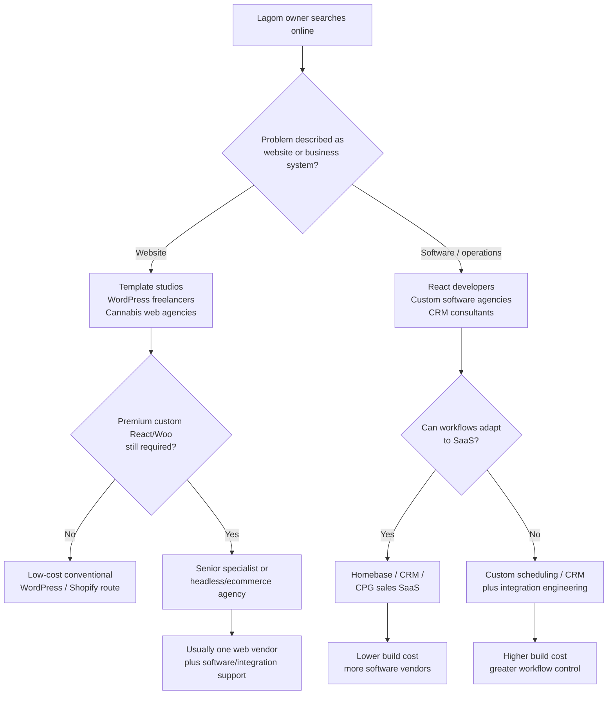
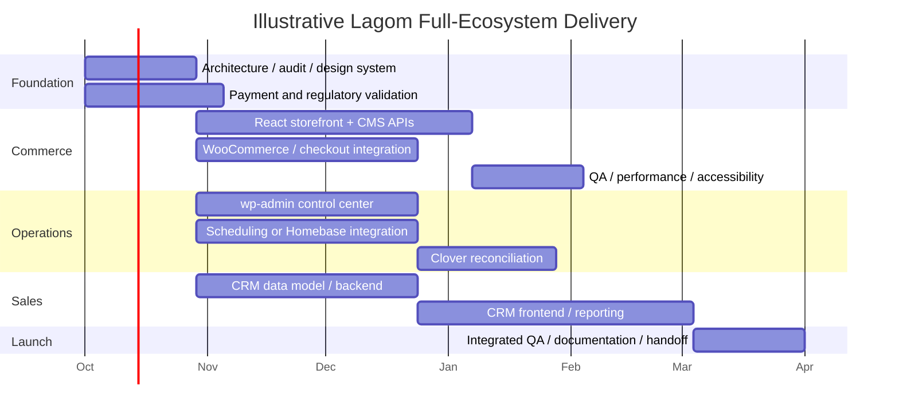

# Lagom Naturals Digital-Ecosystem Alternatives: Live Market Procurement Study

## Executive Summary

**Research date:** September 28, 2026.  
**Geographic frame:** Minneapolis–St. Paul/Minnesota plus U.S. and remote providers realistically hireable by a Minnesota small business.  
**Scope assumption:** “Complete vision” means the full system described in the Lagom brief: premium custom storefront, WordPress/WooCommerce content and commerce backend, custom administrative workflows, employee scheduling, Clover connectivity, CRM/sales operations, backend/database, SEO/performance/accessibility, analytics, deployment, and ongoing support—not merely a redesigned marketing site. The current commercial baseline and the fact that substantial design/prototype/development work already exists come from the supplied project brief. fileciteturn0file0

### The answer in one view

| Question | Evidence-driven conclusion |
|---|---|
| **What would Lagom find online today?** | An extremely wide market: WordPress freelancers advertised around $15–$28/hour on Upwork, experienced relevant marketplace specialists around $40–$100+/hour, Minneapolis agencies commonly listed around $100–$199/hour, and higher-end digital firms at $200–$300/hour. The apparent price spread reflects radically different scopes, staffing models, geographies, and service levels. citeturn20view3turn9search7turn1search0turn1search10 |
| **Is $50/hour automatically “cheap”?** | No. It is not the cheapest rate available online; capable offshore marketplace developers can be found below $50/hour. But **$50/hour is materially below the prevailing listed rate for Minneapolis/U.S. agencies and below many experienced U.S. independent full-stack profiles relevant to this scope**. citeturn3search9turn1search2turn10search3turn10search5 |
| **Are Lagom's fixed project ranges market-rate?** | For a normal WordPress/WooCommerce site or narrowly scoped continuation work, several ranges overlap the lower end of the real market. **For the literal full production-grade scope in the brief—especially custom React commerce, scheduling, Clover reconciliation, and a production CRM—the combined figures are unusually aggressive and in several areas likely under-market unless substantial existing work is reused or the deliverables are phased/MVP-level.** This is an analytical conclusion based on current agency, marketplace, and custom-software benchmarks. citeturn1search2turn2search11turn3search3turn3search11turn9search10 |
| **Could SaaS beat custom development?** | Absolutely in some areas. Scheduling is the strongest example: Clover now presents Homebase as fully embedded for scheduling and time tracking, while Homebase itself starts at $0 and offers paid plans at $30/$70/$120 per location per month before annual discounts. That is a serious alternative to building scheduling software. citeturn20view1turn20view2 |
| **Could SaaS replace the entire vision?** | Not without material compromises. HubSpot, Salesforce, Airtable, monday CRM, Repsly, Ohanafy and similar systems can replace much CRM/field-sales functionality, but Lagom would accept their data models, UI patterns, subscription structures and integration boundaries instead of having its desired workflows inside one custom control center. citeturn13search1turn7search0turn14search2turn14search4 |
| **What is a realistic greenfield full-vision cost?** | My market model places a **budget marketplace build around $25k–$55k; experienced independent/small specialist team around $40k–$90k; boutique local agency around $70k–$160k; specialist multi-vendor approach around $95k–$220k; and single full-service agency around $100k–$275k**. A SaaS-heavy compromise can lower initial implementation to roughly **$18k–$60k**, but adds recurring subscriptions and gives up some custom workflow/UI integration. These are **analytical estimates**, not published provider quotes. They are triangulated against current project minimums, published packages, software-company benchmarks and marketplace pricing. citeturn1search2turn3search3turn3search11turn16search10turn19search0 |
| **What about replacing the current developer midstream?** | A new provider should not be assumed to continue instantly. Public takeover/code-audit offers range from roughly $1,500 at the light end to $4,000–$12,000 for a senior audit, before remediation or feature work. For Lagom's multi-system scope, I would budget **roughly $2.5k–$8k for a clean, well-documented takeover and $5k–$15k+ where documentation, architecture or deployment are uncertain**, before substantial new features. The latter figures are analytical. citeturn17search1turn17search12turn17search13 |
| **What is the largest strategic uncertainty?** | The product category itself. Minnesota OCM is warning of a federal hemp-definition change scheduled to take effect **December 11, 2026**, with potentially major consequences for intoxicating hemp products and associated banking, payments and interstate activity. Meanwhile Shopify Payments, Stripe and WooPayments impose restrictions on hemp/cannabinoid products. Any long-lived commerce architecture should therefore separate the storefront from replaceable payment/compliance components. citeturn11search2turn11search15turn11search3turn12search1turn12search2 |

**Bottom line:** If Lagom's owner seriously researched alternatives for several days, the owner would **not** discover that every other option costs $100,000. They would first see plenty of $1,000–$10,000 websites, $15–$50/hour freelancers and inexpensive SaaS. Some of those alternatives are legitimate and sensible. The catch is that most do **not** reproduce the complete Lagom vision. Once the comparison is limited to premium custom UI, React/WordPress/Woo architecture, custom admin software, Clover integration, scheduling, CRM/backend and ongoing technical ownership, the competitive set shifts toward senior specialists and software agencies whose pricing is substantially above Lagom's current baseline. citeturn9search2turn9search10turn16search1turn1search2turn3search9

The current proposition is therefore best characterized as **low-priced for the complete custom-software interpretation of the scope, but not inherently low-priced for every individual business problem**. Scheduling and basic CRM are the clearest areas where buying SaaS could be cheaper. A conventional or templated website is another. Conversely, a production custom CRM, robust Clover sync, sophisticated admin layer and truly bespoke headless commerce experience are the areas where the current figures look most likely to be underpriced.

## Scope, Requirements, Assumptions, and Research Method

The procurement problem is broader than “hire someone to redesign a WordPress site.” The brief describes at least four different software disciplines: consumer ecommerce, content-management engineering, internal operations software and sales/CRM software, plus integrations, SEO, accessibility, analytics and ongoing technical operations. fileciteturn0file0

### Lagom's actual requirements

| Workstream | What an apples-to-apples provider must be capable of delivering | Why ordinary website quotes are not directly comparable |
|---|---|---|
| **Premium storefront** | Custom responsive UI/UX, merchandising, product/category/PDP/cart experiences, React-capable frontend development, production deployment | A five-page WordPress template or Elementor implementation solves a different problem |
| **WordPress/WooCommerce architecture** | WordPress as structured CMS; WooCommerce as commerce/data layer; APIs to a separated frontend; custom fields/schemas | Installing WooCommerce is not equivalent to designing a decoupled content/commerce architecture |
| **Business control center** | Editor-friendly admin workflows for products, promotions, cannabinoid/nutrition/lab data, locations, FAQs, reusable content and dashboards | This is partly application development inside WordPress, not standard CMS configuration |
| **Employee operations** | Schedules, shifts, availability, publishing, revisions, permissions, announcements, actual-vs-scheduled time and history | This competes with dedicated workforce-management products, not website plugins alone |
| **Clover** | Authentication, employees/shifts/time records, synchronization, reconciliation, error states, potentially events/webhooks where supported | Production API integration needs failure handling and operational ownership, not merely a REST request |
| **Sales CRM** | Accounts, reps, activities, depletions, dashboards, imports/exports, roles, mobile-responsive workflows and eventual database/backend | HubSpot setup and a custom CRM application are different purchases |
| **Search/performance/accessibility** | Technical SEO, structured data, crawl/index architecture, Core Web Vitals, performance engineering and WCAG-oriented remediation | An SEO plugin installation or automated accessibility scan is materially narrower |
| **Lifecycle support** | Hosting/deployment, updates, incident response, feature changes, audits, reporting and architectural continuity | Launch-only project pricing omits the operating cost of owning custom software |

Google explicitly warns that no SEO provider can guarantee a number-one ranking and that third-party tools do not possess Google's internal ranking data; reputable proposals can commit to technical work, content/process deliverables and measurement, not guaranteed ranking positions. citeturn13search0turn13search3 WCAG 2.2 remains the appropriate current W3C reference point; it became ISO/IEC 40500:2025, while WCAG 3 remains a working draft rather than the replacement production standard. citeturn18search0turn18search10

### Research method

This study used four evidence classes, in descending order of weight:

| Evidence label used below | Meaning |
|---|---|
| **PUBLICLY LISTED** | Current price or scope published by the provider/vendor itself |
| **MARKETPLACE LISTED** | Current asking rate, project pricing or profile data shown by a marketplace such as Upwork |
| **THIRD-PARTY REPORTED** | Current Clutch/provider-directory rate, project minimum, review count or team size |
| **ESTIMATED** | My synthesis from engineering scope and multiple market benchmarks; never presented as a provider quote |

The market sample deliberately includes inexpensive providers as well as higher-end firms. Current broad Upwork listings put WordPress developers around $15–$28/hour and WooCommerce around $15–$29/hour, while React's broad marketplace median is around $20–$38/hour. Those are genuine alternatives, but they are marketplace-wide distributions rather than evidence that a senior engineer capable of every Lagom subsystem costs $20/hour. citeturn20view3turn9search7turn9search10

At the other end, September 2026 Clutch data for Minneapolis repeatedly shows web, WordPress and custom-software firms at roughly $100–$199/hour, with some design firms at $200–$300/hour and project minimums ranging from $1,000 to $75,000+. citeturn1search0turn1search2turn1search10

This spread is the principal reason a single “average developer rate” would be misleading.

**Two cost frames are used throughout.** “Greenfield” means a provider must discover, design and build from the beginning. “Replacement/takeover” recognizes the brief's statement that significant design, prototype, scheduling/admin and CRM-direction work already exists. fileciteturn0file0

The study cannot verify the current codebase's quality, test coverage, documentation, percentage completion, deployment state or exact design-system maturity. Those unknowns are among the largest variables in the replacement analysis.

## What the Owner Would Actually See Online

**WHAT THE OWNER WOULD ACTUALLY SEE ONLINE**

A nontechnical owner searching phrases such as “Minneapolis website redesign,” “WooCommerce developer,” “cannabis web design,” “React developer,” “Clover integration developer,” “CRM developer” and “employee scheduling software” would encounter four markets superimposed on one another:

1. inexpensive templated websites and commodity marketplace services;
2. individual specialists selling their time;
3. regional and national agencies with project minimums but often no complete published price;
4. SaaS products offering to eliminate the need to build portions of the system.

That overlap makes online procurement unusually difficult. A $3,000 cannabis site, a $6,000 WooCommerce freelancer project, a $50,000 WordPress agency engagement and a $150,000 custom-software program can all plausibly appear to answer “I need a better website” while supplying fundamentally different assets. Current examples make the contrast explicit: Popproxx markets a cannabis-focused customized-template website from $179/month on a 24-month structure; HerbHosting publishes an $8,900 custom website package; meanwhile enterprise WordPress shops such as 10up list $75,000+ project minimums on Clutch. citeturn16search3turn16search1turn3search3

### Local and regional provider landscape

The following are realistic Minneapolis/Minnesota alternatives surfaced in current searches. Clutch amounts are **THIRD-PARTY REPORTED**, not guaranteed quotes.

| Provider | Type / location | Relevant verified capability | Current pricing signal | Reputation / scale where available | Lagom fit |
|---|---|---|---|---|---|
| **Agency Jet** | Minneapolis digital agency | WordPress/web development and digital marketing | $1k+ minimum; $100–$149/hr | 4.8/5, 57 reviews; 10–49 employees | Viable website/SEO agency; custom internal software would require scope confirmation. citeturn1search0 |
| **Ackmann & Dickenson** | Minneapolis agency | WordPress/digital development | $100–$149/hr | 50–249 employees | Larger delivery bench than an independent; public evidence does not establish full Lagom stack coverage. citeturn1search0 |
| **Electric Citizen** | Minneapolis studio | WordPress/web projects | $50k+ minimum; $150–$199/hr | 2–9 employees | Premium boutique pricing; feasible for public experience but substantially above current Lagom website budget. citeturn1search0 |
| **Inventix Labs** | Minneapolis | WordPress/digital work | $50k+ minimum; $100–$149/hr | 10–49 | High project floor makes it a poor fit for Lagom's current individual module budgets. citeturn1search0 |
| **Creed Interactive** | Minneapolis | WordPress/web development | $5k+ minimum; $150–$199/hr | 10–49 | Plausible public-site partner; rates much higher than $50/hr. citeturn1search0 |
| **Modern Logic** | Minneapolis | Web/software development | $25k+ minimum; $100–$149/hr | 2–9 | Boutique custom-development alternative, but its minimum already approaches Lagom's entire current multi-module baseline. citeturn1search0 |
| **August Ash** | Minnesota | Web/ecommerce/digital services | $10k+ minimum; $150–$199/hr | Listed local provider | Stronger ecommerce/digital-services fit; internal software depth requires proposal-level verification. citeturn1search0 |
| **SG Web Partners** | Minneapolis | WooCommerce-focused development | $25k+ minimum; $150–$199/hr | 10–49; Clutch focus reported as 100% WooCommerce | One of the clearest apples-to-apples ecommerce specialists locally, but dramatically higher commercial floor. citeturn1search1 |
| **fjorge** | Minneapolis | Custom software; React among listed technologies | $10k+ minimum; $100–$149/hr | 50–249 | Better fit for React/internal systems than a conventional web studio; likely could cover more of the software side. citeturn1search7 |
| **Emergent Software** | Minneapolis | Custom software development | $25k+ minimum; $150–$199/hr | 50–249 | Credible alternative for CRM/scheduling/integrations; likely excessive for small isolated site changes. citeturn1search14 |
| **Mankato Web Design** | Minnesota independent provider | WordPress-focused development | $5k+ minimum; $100–$149/hr | Six reviews in current Clutch result | Useful evidence that even an independent local WordPress provider can list materially above $50/hour. citeturn1search4 |
| **EMSOFT** | Minneapolis studio | WordPress, web development; own materials also describe WooCommerce/integration work | $1k+ minimum; $25–$49/hr | 2–9 on Clutch | Important anti-bias example: a local small firm can compete at or below the current developer's rate. citeturn1search3turn0search13 |
| **Clockwork** | Minneapolis digital agency | Web design/digital products | $75k+ minimum; $200–$300/hr | 50–249 | High-end organizational alternative; not economically comparable to a solo developer. citeturn1search10 |

The local evidence therefore **does not support a claim that every Minnesota provider costs more than $50/hour**—EMSOFT is an obvious counterexample—but the center of the relevant local agency market is much higher, particularly once the work becomes custom software rather than standard WordPress production. citeturn1search2turn1search3

### U.S., remote, specialist and cannabis-facing agencies

| Provider | Positioning | Pricing evidence | What matters to Lagom |
|---|---|---|---|
| **10up** | Enterprise WordPress engineering | $75k+ minimum, $150–$199/hr; 50–249 employees — THIRD-PARTY REPORTED | Strong technical WordPress benchmark; economically in another tier from Lagom's current proposal. citeturn3search3 |
| **Human Made** | Enterprise WordPress | $50k+ minimum, $150–$199/hr; 50–249 — THIRD-PARTY REPORTED | Strong complex-WP comparison; common reviewed project range reported at $50k–$199,999. citeturn3search11 |
| **rtCamp** | WordPress engineering, APIs/custom development | $10k+ minimum, $50–$99/hr — THIRD-PARTY REPORTED | One of the better lower-rate specialist-agency comparisons to Lagom. citeturn3search7turn3search12 |
| **XWP** | WordPress specialist | $50k+ minimum, $150–$199/hr — THIRD-PARTY REPORTED | Relevant to sophisticated WordPress/headless work, but enterprise-oriented. citeturn3search8 |
| **HUEMOR** | Web design/development | $25k+ minimum, $150–$199/hr — THIRD-PARTY REPORTED | Premium brand/UI benchmark. citeturn3search8 |
| **Codup** | Ecommerce/custom software | $10k+ minimum, $50–$99/hr — THIRD-PARTY REPORTED | Particularly relevant because its range bridges WooCommerce and custom software without $150+/hour pricing. citeturn1search6 |
| **UPQODE** | U.S.-serving web design/development | $5k+ minimum, $100–$149/hr; 4.9/108 reviews | A mainstream agency alternative; current cannabis-industry Clutch category also surfaces it. citeturn16search10 |
| **ThrillX** | Design/development/CRO | $1k+ minimum, $100–$149/hr; 5.0/40 reviews | Lower project floor but agency hourly economics remain far above $50. citeturn16search10 |
| **Collective42** | Design, development, SEO | $10k+ minimum, $100–$149/hr; 5.0/33 reviews | Useful mixed web/SEO alternative. citeturn16search10 |
| **Jacob Tyler** | High-end web/design | $5k+ minimum, $200–$300/hr | Illustrates upper-end brand/design pricing in the legal-cannabis category. citeturn16search10 |
| **Optimum7** | Web/ecommerce/digital | $1k+ minimum, $100–$149/hr | Broad digital agency alternative surfaced for legal-cannabis work. citeturn16search10 |
| **The Cannabis Marketing Agency** | Cannabis-only agency | $1k+ minimum; $100–$149/hr; 2–9 employees; WordPress and technical SEO listed | More category knowledge than a generic agency, but public evidence of complex Lagom-style React/Woo/internal-software delivery is limited. citeturn16search13 |
| **HerbHosting** | Cannabis website specialist | Signature website $8,900; ongoing $1,250/mo and $2,500/mo packages — PUBLICLY LISTED | A particularly useful comparison: premium cannabis website, SEO foundation and support, but not a custom CRM/scheduling platform. citeturn16search1 |
| **Rank One** | Cannabis/dispensary website platform | $799/mo Core + $3k onboarding; $2,499/mo Success + $5k onboarding; additional menus/locations $299/mo — PUBLICLY LISTED | Strong example of recurring platform economics and vendor lock-in versus owned custom architecture. citeturn16search2 |
| **MJSEO Agency** | Cannabis SEO/web | Web design from $1,500; websites from $4,000; dedicated team from $15,000 — PUBLICLY LISTED | Shows credible low-end cannabis specialist pricing, but advertised website scope is not evidence of a full headless/internal-software ecosystem. citeturn16search4 |
| **NYAMI Digital** | Cannabis branding/web | Website/app MVP advertised at $5,000; full-service strategy $7,500 — PUBLICLY LISTED | A direct counterexample to the idea that cannabis specialization necessarily means a $20k+ website. citeturn16search11 |

There is **no defensible basis in this research for a blanket statement that cannabis agencies charge a fixed percentage premium**. Some specialists are inexpensive, some are agency-priced, and many do not publish enough data to measure a category surcharge. What is clearly different is the platform/payment/compliance environment and the value of providers who already understand those constraints. citeturn16search1turn16search4turn11search3turn12search1

### Freelancer and marketplace market

Upwork's own current market pages describe broad WordPress pricing around $15–$28/hour, WooCommerce around $15–$29/hour, and React around $20–$38/hour. It also presents project examples such as roughly $2,500–$8,000 for ecommerce WordPress work and $5,000–$15,000+ for larger WooCommerce builds. Those values are important—but they include worldwide providers and scopes that often stop far short of custom software platforms. citeturn20view3turn9search10turn9search7

A more revealing picture comes from actual profiles:

| Marketplace example | Listed rate / evidence | Relevant capability | Procurement implication |
|---|---:|---|---|
| Denys K., Ukraine | $60/hr; 100% JSS, 42 jobs | WordPress, React, WooCommerce, APIs, performance/accessibility | Strong evidence that a capable cross-stack specialist can be near—but above—the current $50 rate. citeturn9search0 |
| Tahir A., Pakistan | $40/hr; Top Rated Plus, 100% JSS, 5,632 hours | WordPress/WooCommerce custom plugins | Credible lower-cost specialist alternative. citeturn9search3 |
| Popoola P., Nigeria | $15/hr | Headless WordPress/React; inexpensive catalog offerings | Demonstrates true low-cost global supply, although catalog scope and production governance require scrutiny. citeturn9search4 |
| Sheheryar K., Pakistan | $25/hr; 100% JSS, 47 reviews | React, WordPress, WooCommerce, APIs | Another credible below-$50 alternative. citeturn9search5 |
| Jake V., New Jersey | $50/hr | React/Next/Node/PHP/WordPress/Postgres | Near-perfect rate benchmark for a U.S. full-stack independent at the same advertised hourly level. citeturn9search6 |
| Sebastian R., Texas | $75/hr | Principal-level React/Node/Python/Supabase | Relevant to Lagom's proposed React/Supabase CRM architecture. citeturn9search8turn10search7 |
| Dmytro K., Ukraine | $50/hr; 5.0/68, 147 jobs, $300k+ | WooCommerce custom plugins, REST, React-based WordPress interfaces, inherited projects | Very direct marketplace alternative at exactly the current rate. citeturn9search9 |
| Suat K., Turkey | $100/hr; Expert-Vetted / Top Rated Plus | Full-stack React/Node/PHP | Specialist upper-end marketplace rate. citeturn10search0 |
| Linda R., Colorado | $100/hr | React, APIs, databases, DevOps | U.S. senior software-engineering comparison. citeturn10search5 |
| Christopher B., Iowa | $100/hr; 100% JSS | PHP/Laravel/WordPress/WooCommerce plus CRM/Salesforce integration | Particularly relevant to mixed ecommerce/CRM integration work. citeturn10search12 |

This evidence leads to a more precise conclusion than “freelancers are cheap.” **Marketplace location and specialization dominate the rate.** Lagom could realistically hire strong overseas specialists for $25–$60/hour, U.S. full-stack independents around $50–$100/hour, or agencies at $100–$200+. It could also hire much cheaper people, but the owner would then need to evaluate architecture, communication, QA and ownership personally or through another technical advisor. citeturn9search13turn10search0turn3search9

The underlying procurement funnel looks approximately like this:

The deceptively attractive first-search offers are therefore often real, not bait—but the comparison changes once the owner asks, “Does this include our custom React storefront, bespoke wp-admin, Clover reconciliation, scheduling application, CRM and backend?”

## SaaS, Off-the-Shelf Alternatives, Clover, and Industry Constraints

The strongest challenge to custom development is not another programmer. It is **not building certain modules at all**.

### Scheduling and employee operations

Clover itself now states that Homebase is fully embedded for scheduling and time tracking and that employees can clock in/out on Clover devices while owners build schedules and manage time inside the Clover experience. citeturn20view1

Homebase's current public pricing is unusually compelling for a small operation:

| Product | Current price | Relevant functions | Lagom compromise |
|---|---:|---|---|
| **Homebase Basic** | $0/location/month for one location, up to 10 employees | Basic scheduling, time tracking, POS integration | Limited customization; data/workflow lives in Homebase/Clover rather than Lagom's WordPress control center. citeturn20view2 |
| **Homebase Essentials** | $30/mo monthly or $24/mo annual per location | Advanced scheduling/time tracking, team communication | Very strong off-the-shelf substitute for much of custom scheduling. citeturn20view2 |
| **Homebase Plus** | $70/mo monthly or $56/mo annual | Adds scheduling assistant, PTO/time-off, departments/permissions | Covers several requirements that would otherwise require custom engineering. citeturn20view2 |
| **Homebase All-in-One** | $120/mo monthly or $96/mo annual | Adds onboarding, labor-cost management, HR/compliance | Broadest replacement; still not a Lagom-branded WordPress workflow. citeturn20view2 |
| **Deputy** | Lite $5/user/mo; Core $6.50; Pro $9 | Scheduling/time/workforce management | Per-user economics; separate vendor and UI. citeturn5search1 |
| **When I Work** | Essentials $2.50/user/mo; Pro $5/user/mo | Scheduling, attendance and team workflows | Lower cost; separate operational system. citeturn5search2 |

**Finding:** A $2,000–$3,500 custom scheduling module can be “cheap” compared with custom development market rates and simultaneously be “expensive” compared with Homebase. Both statements can be true. The decision turns on whether Lagom genuinely benefits from a unified, bespoke WordPress admin and custom schedule-vs-actual workflows, or would be equally productive adapting to Homebase.

### What Clover actually exposes

Clover's developer documentation provides OAuth-based API authorization and employee-shift endpoints for creating, reading and updating shift records. That gives a technically credible foundation for employee/time reconciliation rather than requiring screen scraping or manual exports. citeturn4search0turn4search4turn4search7turn4search9turn4search18 Clover also documents private apps for merchant-specific implementations. citeturn4search16

However, this investigation did **not** establish authoritative documentation guaranteeing a shift-specific real-time webhook for every desired scheduling event. An implementation proposal should therefore treat real-time employee/shift webhooks as **unverified until proven in a Clover developer sandbox**, and should have a polling/reconciliation strategy if necessary.

This distinction matters commercially. “Connect to Clover” could mean a few hours of read-only reporting, or it could mean OAuth lifecycle management, bidirectional synchronization, mapping employees, replay/idempotency, error queues, reconciliation, monitoring and ongoing API-change support.

### CRM, sales operations and depletion alternatives

| Product | Current pricing signal | What it can replace | Major compromise |
|---|---:|---|---|
| **HubSpot Sales Hub** | Starter begins $20/seat/mo in current product catalog; Professional $100/seat/mo plus $1,500 required onboarding; Enterprise $150/seat/mo plus $3,500 onboarding | Contacts/accounts, pipelines, activities, automation, reporting | Lagom adapts to HubSpot's application; deeper beverage-specific depletion modeling may need custom properties, integrations or higher tiers. citeturn13search1 |
| **Salesforce Sales Cloud** | Public plans include Starter around $25/user/mo and higher tiers around $100–$350/user/mo depending edition | Mature CRM, roles, workflows, extensive ecosystem | More implementation/admin overhead; full customization can become a consulting project. citeturn7search12 |
| **monday CRM** | Current public page shows Basic and Standard beginning around $12 and $17/seat/mo with annual billing | Lightweight account/pipeline/workflow management | Less purpose-built for beverage distribution/depletions; custom boards/automations required. citeturn6search7 |
| **Airtable** | Team $20/user/mo annual; Business $45/user/mo annual | Custom relational-ish operational app, sales tracking, light dashboards | UI/workflow limits compared with bespoke React; Team plan includes 50k records/base and 100k API calls/workspace/month; portals cost extra. citeturn7search0turn7search1turn7search2 |
| **Repsly** | Quote-based; 12-month minimum and annual upfront payment publicly disclosed | CPG retail execution, account management, scheduling, API access, field activity and reporting | Pricing hidden; purchase is a specialized field-sales system rather than a custom Lagom CRM. citeturn14search4 |
| **Ohanafy** | Quote-based subscription plus one-time implementation fee | Beverage CRM/ERP workflows, accounts, visits, orders, depletions, programs, mobile reps | Larger platform commitment; based on Salesforce; customization follows vendor/platform model. citeturn14search2turn14search10turn14search14 |
| **Shopra** | $29/mo Pro; $79 Business; $179 Advanced; Enterprise custom | Beverage data/depletion analytics and distributor/retailer data intelligence | Analytics layer rather than full CRM; does not replace bespoke sales workflow by itself. citeturn14search1 |
| **Bevbase** | $250 monthly or $200/mo annual for initial workspace; teammates $100 monthly/$80 annual | Beverage account/prospect intelligence and sales workflows | Recurring specialist software; custom operational behavior constrained by product. citeturn14search11 |

For Lagom, Ohanafy and Repsly are particularly important discoveries because they show that “custom CRM versus generic HubSpot” is a false binary. There is a **beverage/CPG software category** that already understands accounts, field reps, retail execution and depletions. citeturn14search2turn14search4

The business case for a custom CRM should therefore be proven against those systems, not merely against spreadsheets.

### Ecommerce, WordPress and custom backend economics

WooCommerce itself is currently free/open source, with Woo estimating hosting for most stores at roughly $25–$350/month and extensions commonly at $29–$299/year each. Woo's own current pricing material also illustrates a customized luxury ecommerce build with $70,000 initial development—useful evidence that “WooCommerce” does not imply inexpensive implementation. citeturn19search0

Shopify's September 2026 materials put Basic at roughly $29/month with annual billing, Grow at $79, Advanced at $299 and Plus from $2,300/month. citeturn19search10 A conventional Shopify implementation can therefore be much faster and cheaper than custom headless WooCommerce.

For Lagom, however, platform eligibility is not merely a design decision. Shopify states that Shopify Payments does not support hemp, CBD or THC businesses and requires an eligible third-party payment provider; approval is not guaranteed. citeturn11search3 Stripe's current restricted-business materials prohibit cannabis businesses and subject certain CBD activity to restrictions/due diligence. citeturn12search1 WooPayments likewise does not support CBD/other hemp-derived products, while WooCommerce's open-source platform can be used with alternative payment gateways subject to those providers' rules. citeturn12search2turn12search4

That makes an open, processor-agnostic commerce layer potentially valuable to Lagom—but it does **not** mean every WooCommerce payment processor will accept Lagom.

For a custom CRM/backend, the proposed Supabase/Vercel architecture is inexpensive at small scale. Supabase Pro currently starts at $25/month with included allowances, while Vercel Pro starts at $20/month plus usage, giving a nominal infrastructure floor around $45/month before domains, monitoring, email/SMS, storage growth and other services. citeturn8search0turn8search1 That low infrastructure price should not be confused with low software-development cost.

### The 2026 hemp-policy issue cannot be ignored

Minnesota's Office of Cannabis Management currently regulates lower-potency hemp edibles/beverages and describes state product limits including 5 mg THC per serving and up to 10 mg in a beverage container under Minnesota's framework. citeturn11search0 More importantly for a system being designed in late September 2026, OCM is warning businesses about a federal hemp-law change scheduled for **December 11, 2026** that could substantially change which intoxicating hemp products qualify as legal hemp federally and could affect banking, financial services, POS relationships and interstate activity. citeturn11search2turn11search15

This does **not** mean Lagom should stop investing in digital infrastructure. It means architecture should avoid unnecessary lock-in and the business should obtain specialized legal/payment advice before making assumptions about the post-December-2026 transaction stack.

## Cost, Effort, Delivery, and Recurring Economics

### Service-by-service market analysis

The price bands below deliberately distinguish observed market evidence from my analytical estimates. They describe **production-quality custom work**, not the cheapest visible offer.

| Lagom requirement | Typical market approach | Realistic market price | Engineering effort | Common exclusions | Likely vendor |
|---|---|---:|---:|---|---|
| **Premium React/Woo storefront** | Custom UX/UI + React/headless frontend against WordPress/Woo | **$12k–$35k independent; $25k–$80k+ agency — ESTIMATED**. Basic marketplace Woo builds can appear around $5k–$15k+, while specialist/headless agencies go much higher. citeturn9search10turn2search11turn3search8 | **160–300h — ESTIMATED** | Brand strategy, photography, copy, complex subscriptions/loyalty, payment underwriting | Senior frontend/ecommerce specialist or agency |
| **WordPress CMS/API layer** | Custom fields/schema, API endpoints, reusable blocks/content | **$5k–$15k independent; $12k–$35k agency — ESTIMATED** | **90–180h — ESTIMATED** | Large migration, DAM/PIM, multilingual, custom editorial tooling | WordPress specialist |
| **Custom wp-admin control center** | Plugins/admin applications/custom tables and workflows | **$5k–$18k independent; $12k–$40k agency — ESTIMATED** | **80–180h — ESTIMATED** | Major reporting/data warehouse work | WordPress application developer |
| **Custom scheduling** | Purpose-built admin/mobile workflow | **$8k–$25k independent; $20k–$60k agency — ESTIMATED** | **120–260h — ESTIMATED** | Payroll engine, HR compliance, native apps | Full-stack developer/software shop |
| **Clover production integration** | OAuth, employees/shifts, mapping, sync, reconciliation/error handling | **$3k–$10k specialist; $7.5k–$20k+ agency — ESTIMATED** | **50–120h — ESTIMATED** | Undocumented API behavior, vendor certification, payment functionality | API/integration engineer |
| **Custom CRM frontend + backend** | React + relational DB/auth/roles/reporting/import/export | **$15k–$45k independent/small team; $35k–$120k+ agency — ESTIMATED** | **220–500h — ESTIMATED** | Advanced BI, mobile native app, marketing automation, massive data migration | Full-stack/software consultancy |
| **SEO/performance/accessibility** | Technical audit plus engineering remediation | **$2k–$8k specialist sprint; $5k–$20k+ broader agency project — ESTIMATED** | **60–140h — ESTIMATED** | Ongoing content/link acquisition, legal accessibility certification | SEO/performance engineer + accessibility specialist |
| **Brand/creative implementation** | Art direction, production assets, digital creative | **$2k–$10k boutique scope; $5k–$25k+ broader program — ESTIMATED** | Scope-dependent | Photography/video, packaging, large copy program | Designer/creative studio |
| **Analytics/audit/reporting** | GA/ecommerce setup, dashboards, technical/UX report | **$1k–$5k specialist; $3k–$12k agency — ESTIMATED** | **16–48h — ESTIMATED** | Enterprise BI/data warehouse | Analyst/consultant |
| **Deployment/QA/documentation** | Environments, CI/CD, regression tests, monitoring, handoff | **$2k–$10k — ESTIMATED** | **70–160h across ecosystem — ESTIMATED** | 24/7 operations/SLA | Lead developer/DevOps/QA |

The engineering-hour estimates above are **bottom-up scope estimates**, not prices divided by hourly rates. They assume a professional production implementation with responsive QA, error states and documentation. The largest variables are design readiness, code reuse, number of products/pages, checkout/payment complexity, data migration, authentication and permissions, API quality, testing depth and number of revision rounds.

A complete greenfield system could therefore reasonably involve roughly **800–1,600 engineering/design/QA hours when all major workstreams are counted**, with significant overlap possible. That is an analytical planning range, not an observed industry statistic.

Current market evidence supports the direction of these figures. Minneapolis senior custom-software firms are commonly listed around $100–$149/hour, with Clutch reporting fixed-bid MVP work often around $35,000–$60,000 and larger programs much higher. citeturn1search2 Provider-published 2026 examples put integrated custom WordPress projects at $30,000–$120,000 and headless commerce at $80,000–$300,000, though those are the selling provider's own benchmarks and should not be treated as neutral averages. citeturn2search11

### Full-vision cost scenarios

These are **ESTIMATED procurement scenarios**, not quotes.

| Scenario | Initial implementation | Recurring monthly | Recurring annual | Vendors / contracts | Timeline | Major compromise | Confidence |
|---|---:|---:|---:|---:|---|---|---|
| **Budget freelancer / marketplace** | **$25k–$55k** | $300–$1,200 | $3.6k–$14.4k | 2–5 | 5–9 months | More owner-led coordination; uneven QA/documentation risk; likely offshore/time-zone mix | Medium |
| **Experienced independent specialist** | **$40k–$90k** | $1k–$3k | $12k–$36k | 1–3 | 4–8 months | Capacity/bus-factor constraints; may subcontract design/SEO | Medium-high |
| **Small local/boutique agency** | **$70k–$160k** | $2k–$6k | $24k–$72k | 1–3 | 4–7 months | Higher cost; some firms still lack internal CRM/Clover expertise | Medium-high |
| **WordPress/ecommerce specialist + software vendor** | **$95k–$220k** | $3k–$8k | $36k–$96k | 3–5 | 5–9 months | Strong specialization but significant integration/project-management overhead | Medium |
| **Single full-service development agency** | **$100k–$275k+** | $4k–$12k+ | $48k–$144k+ | 1 primary + software vendors | 4–8 months | Highest professional-services cost; agency process/overhead | Medium |
| **SaaS-heavy approach** | **$18k–$60k** | $300–$2.5k+ | $3.6k–$30k+ | 4–7 | 2–5 months | Lagom adapts workflows to Homebase/CRM/SaaS; less unified custom control center | Medium-high |
| **Best-of-breed multi-vendor** | **$50k–$140k** | $1.5k–$6k | $18k–$72k | 4–7 | 4–8 months | Integration/ownership complexity; multiple support queues | Medium |

These ranges intentionally exclude advertising spend and payment-processing transaction charges because revenue volume and Lagom's ultimately eligible processor are unknown. Payment eligibility is especially material in this product category. citeturn11search3turn12search1turn12search2

The SaaS-heavy scenario is not a straw man. A plausible version would be a premium but conventional WooCommerce or Shopify storefront, Homebase through Clover, HubSpot/monday/Airtable or beverage-specific CRM, Shopra/Bevbase for depletion intelligence, and limited custom middleware. SaaS subscriptions can be dramatically cheaper than writing scheduling or CRM software; the tradeoff is fragmented interfaces and less bespoke workflow control. citeturn20view1turn13search1turn14search1turn14search11

### Greenfield versus takeover

A replacement provider should first answer five questions: Can the existing frontend be retained? Is wp-admin code modular and documented? Are database schemas sound? Are environments/deployments reproducible? Are credentials, domains, repositories and third-party accounts controlled by Lagom?

Public takeover/audit services confirm that this discovery has real market value. Leanware publishes $4,000–$12,000 for a code audit taking roughly one to two weeks; Signal Shift Labs publishes $2,500–$5,000 for a one-week code audit; AX Development starts product takeover engagements at $5,000. citeturn17search1turn17search13turn17search12

For Lagom I would use the following **analytical takeover allowance**:

| Existing-system condition | Takeover allowance before major new feature work | Likely effect |
|---|---:|---|
| Clean Git history, readable architecture, staging/prod documented, design system and APIs clear | **$2.5k–$5k** | New provider can begin incremental work relatively quickly |
| Mixed documentation, multiple custom WP/React areas, some uncertain dependencies | **$5k–$8k** | One to three weeks of audit/familiarization and fixes |
| Fragmented deployment, undocumented credentials/data flows, technical debt or abandoned prototypes | **$8k–$15k+** | Stabilization and possible partial rewrite before normal velocity |

An outside provider might absorb part of this cost into discovery rather than invoice an “audit” line, but the work does not disappear.

The incumbent developer therefore has an economically meaningful continuity advantage **only if the existing implementation is sound and documented**. Knowledge of undocumented code is valuable in the short term but becomes a business risk if that knowledge exists only in one person's head.

### Delivery sequence

A realistic complete build is more likely to be phased than launched as one giant project.

This is an analytical sequence, not a commitment. Some streams could run concurrently with multiple developers; a solo developer would need to serialize more of them. Published agency examples for custom integrated WordPress projects commonly cite multi-month schedules, while one Minneapolis WordPress provider publishes roughly four-to-eight-week timelines for ordinary WordPress work—another illustration of how scope changes the calendar. citeturn2search11turn0search5

### Recurring costs

A custom ecosystem does not become free when it launches. WooCommerce estimates typical hosting around $25–$350/month and premium extensions around $29–$299/year each. citeturn19search0 A minimal custom CRM running on Supabase Pro and Vercel Pro starts near $45/month before usage and ancillary services. citeturn8search0turn8search1

Managed WooCommerce support also has a very broad market. WooNinjas, for example, publicly starts at approximately $259/month billed annually, while broader embedded web-team retainers can reach several thousand dollars per month; Pixel Lab publishes $4,995/month for approximately ten hours of work per week and $8,495 for a higher-capacity tier. citeturn15search12turn15search16

Those are different products: $259/month is primarily care/maintenance; $5,000–$8,500/month is ongoing development capacity. Lagom should not compare them as if both mean “maintenance.”

## Current Proposal Comparison and Apples-to-Apples Assessment

The brief's current fixed ranges total **$13,600–$22,500 before integration charges**. Adding one $750–$2,000 integration produces approximately **$14,350–$24,500**; adding two produces **$15,100–$26,500**. The hourly arrangement is $50/hour, with $2,000 funding 40 hours. fileciteturn0file0

That arithmetic alone does not prove value. The important question is what those figures actually buy.

### Where the current offer is cheaper

**Hourly custom development.** At $50/hour, the current rate is roughly half or less of many listed Minneapolis agency rates of $100–$199/hour. It is also below multiple U.S. senior marketplace profiles at $75–$100/hour. citeturn1search0turn1search2turn10search3turn10search5

**A true custom CRM.** If the quoted $3,000–$5,500 CRM scope genuinely means production React UI, database/backend, authentication, roles, robust reporting, imports/exports and deployment, it is materially below normal U.S. custom-software economics. Minneapolis custom-software listings frequently start at $10k–$50k+, and Clutch's local overview cites MVP ranges around $35k–$60k. citeturn1search2turn1search9

**A true custom scheduling application.** $2,000–$3,500 is low for greenfield scheduling software with employees, availability, publishing, revision history, permissions, exports and reconciliation. The caveat is that “custom scheduling” may not be the economically optimal purchase because Homebase can solve much of the business problem for tens of dollars per month. citeturn20view2

**Headless/custom commerce.** $4,500–$6,000 is competitive to very low if it genuinely includes bespoke premium UI, React implementation, WordPress/Woo APIs, product/category/cart UX, responsive QA and deployment. It is not extraordinarily cheap for a conventional WordPress/WooCommerce build; Upwork's own broader project data reaches into this range. citeturn9search10

### Where the current offer is broadly market-rate

**Basic-to-mid-level WooCommerce website work:** $4,500–$6,000 overlaps real marketplace and small-studio offers when the scope is conventional rather than architecturally ambitious. Cannabis agencies also advertise complete sites around $4,000–$8,900. citeturn16search1turn16search4turn9search10

**Simple integrations at $750–$2,000:** A stable one-way API connector or narrow automation can plausibly fit this range. It should not be generalized to every integration.

**$750–$1,500 SEO/performance/accessibility:** Reasonable for a focused audit or bounded remediation sprint; likely insufficient for comprehensive engineering remediation plus ongoing SEO. A WordPress specialist currently publishes performance projects around $3,000–$10,000, illustrating the difference between a bounded audit and a full optimization engagement. citeturn2search9

**$500–$1,250 creative batches and $350–$750 analytics/audits:** These can be reasonable for deliberately narrow deliverables. They should not be marketed as equivalents to full brand strategy, production photography, accessibility certification or a major analytics implementation.

### Where the current offer may be underpriced

The following are the areas where scope risk is greatest:

| Current line | Why underpricing risk exists |
|---|---|
| **CRM $3k–$5.5k** | A true production CRM can consume hundreds of engineering hours; this range is more credible for an MVP/front-end phase, existing-code continuation or tightly limited workflow. |
| **Scheduling $2k–$3.5k** | Production scheduling with history, permissions, actual-time comparison and mobile admin is application development, not a small WP plugin. |
| **Clover/integration $750–$2k** | Adequate for narrow API work; aggressive if the definition includes secure OAuth, sync states, reconciliation, monitoring and production support. Clover's API supports real employee/shift operations, meaning the integration can become operationally significant. citeturn4search0turn4search4 |
| **WordPress admin $2.5k–$4k** | Reasonable for custom fields/admin refinement; low if it evolves into a full operational application with dashboards and many custom entities. |
| **Website $4.5k–$6k** | Fine for a well-reused existing design/codebase; low for a genuinely greenfield custom React/headless commerce program. |

The strongest evidence that the **complete** scope may be underpriced is not a rate comparison. It is that the full fixed-price package before integrations is only $13.6k–$22.5k, while single-market alternatives regularly charge that much—or considerably more—for only the website, only the WooCommerce engagement, or only a custom-software MVP. citeturn1search1turn1search2turn3search8

That should not be converted into the sales claim “the project is worth $200,000.” The correct conclusion is narrower: **the listed current module prices cannot reasonably be compared with full U.S. agency greenfield pricing unless both scopes and completion standards are first made identical.**

### Where the current offer could be overpriced

There are legitimate cases.

**Custom scheduling could be unnecessarily expensive** if Lagom's workflows can be satisfied by the Homebase functionality Clover already embeds. A one-location business might spend $0–$120/month on Homebase rather than thousands up front plus custom maintenance. citeturn20view1turn20view2

**A custom CRM could be unnecessary** if Lagom primarily needs accounts, contacts, rep activities, pipeline and standard dashboards. HubSpot, monday, Airtable, Salesforce, Repsly or Ohanafy may deliver those outcomes sooner and with less software ownership. citeturn13search1turn7search0turn14search2turn14search4

**Headless React could be unnecessary** if the desired premium experience can be achieved with a well-built custom WordPress/WooCommerce frontend. Headless architecture adds deployment, API, caching and debugging surfaces. The business case should be visual/functional differentiation, performance and architectural flexibility—not modernity for its own sake.

### What a low-cost alternative really means

A low-cost alternative is not automatically bad.

A $4,000 cannabis website from a specialist may be an excellent purchase for a company that needs a polished marketing/ecommerce presence and does not need bespoke internal software. MJSEO publicly offers sites from that level; NYAMI markets a website/app MVP at $5,000; Upwork contains skilled WooCommerce specialists well below U.S. agency pricing. citeturn16search4turn16search11turn9search3

The compromise is usually one or more of: template/theme dependence, narrower discovery, fewer custom interactions, no custom internal systems, limited QA, fewer stakeholder workshops, a single freelancer rather than redundant team coverage, offshore time zones, or a reliance on plugins/SaaS instead of original application code.

Those compromises may be perfectly rational for Lagom. They simply must appear in the comparison.

### What an agency alternative really means

An agency premium can purchase access to several specialists, project management, design resources, QA capacity, coverage when one employee is unavailable and a more formal support process. The current Minneapolis market shows that this commonly comes with $100–$199/hour pricing and project floors well above the current Lagom modules. citeturn1search0turn1search10

Agency status does **not** guarantee better code, design or communication. Small specialists can outperform large firms. Conversely, agency redundancy is a real advantage over a single individual for business-critical software.

### What Lagom would likely buy from multiple vendors

A best-of-breed alternative could easily become:

| Need | Likely vendor |
|---|---|
| Premium site/ecommerce | Web/ecommerce agency |
| Hosting/deployment | Managed host + Vercel or comparable cloud |
| Payment processing | Cannabis/hemp-compatible processor |
| Scheduling/time clock | Homebase or Deputy |
| POS/time data | Clover |
| CRM | HubSpot/Salesforce/Ohanafy/monday/etc. |
| Depletion/CPG analytics | Shopra/Bevbase/Repsly or distributor feeds |
| SEO/content | SEO specialist |
| Creative | Designer/photo/video resource |
| Cross-system automation | Integration developer/consultant |

That is potentially **six or more commercial relationships**, even if only two or three are development vendors. The benefit is specialization and replaceability; the cost is vendor management and fragmented accountability.

### Apples-to-apples comparison

| Dimension | Current Lagom developer | Experienced freelancer | Boutique agency | Full-service agency | SaaS-heavy stack |
|---|---|---|---|---|---|
| **Likely implementation economics** | Current baseline $13.6k–$22.5k + integrations, assuming quoted scopes | ~$40k–$90k complete custom ecosystem — EST. | ~$70k–$160k — EST. | ~$100k–$275k+ — EST. | ~$18k–$60k — EST. |
| **Rate signal** | $50/hr | Often ~$40–$100+ relevant specialist examples | Frequently $100–$199 local | $150–$300 possible | Mostly subscription + implementation |
| **Custom UX/workflow** | Potentially very high | High | High | High | Low–medium |
| **Existing Lagom knowledge** | Highest | None at start | None at start | None at start | None |
| **Technical vendor count** | 1 primary | 1–3 | 1–3 | 1 primary | 2–5 integrators/platform specialists |
| **Software contracts** | Still several | Several | Several | Several | Many |
| **Speed to first result** | Potentially fastest because work exists | Medium after takeover | Medium | Medium | Fastest for scheduling/CRM |
| **QA/team redundancy** | Lowest unless subcontracted | Low–medium | Medium–high | Highest | Vendor-dependent |
| **Bus-factor risk** | Highest | High | Lower | Lowest | Low for SaaS itself; integration expertise still matters |
| **Workflow fit** | Potentially exact | Potentially exact | Potentially exact | Potentially exact | Lagom must adapt |
| **Architecture ownership** | Potentially strong, contract-dependent | Potentially strong | Contract-dependent | Contract-dependent | Lowest where core functionality belongs to SaaS vendor |
| **Switching cost** | Existing custom-code knowledge | Moderate/high | Moderate | Moderate/high | Data/configuration migration + integration rebuild |
| **Best case** | Very high value if execution/documentation are strong | Flexible expert partnership | Balance of expertise and redundancy | Maximum bench/discipline | Lowest cost and fastest standard operations |
| **Core risk** | Capacity, continuity and single-person dependency | Similar bus factor | Higher spend | Very high spend/process overhead | Fragmentation and workflow compromise |

### The independent-developer disadvantages should be presented explicitly

A credible recommendation cannot omit them.

A single developer has finite capacity. Illness, vacation, competing client work or departure can interrupt delivery. Design, security, accessibility, SEO, DevOps and backend architecture are distinct specialties; one person is unlikely to be best-in-class at all of them. A solo partner also lacks automatic peer review and the scheduling redundancy of a team.

Therefore, the lower price is sustainable only if Lagom also receives good documentation, repository ownership, reproducible deployments, credential/account ownership, database documentation, API notes, tests where justified and a handoff path. Those practices reduce the “bus factor” and increase the resale/takeover value of the software.

## Commercial Positioning, Implications, Gaps, and Sources

### Key sales and presentation facts

The safest way to present the research to Lagom is to separate facts from interpretation.

| Category | Statement |
|---|---|
| **FACT** | Current Minneapolis WordPress/web/custom-software agencies commonly list $100–$199/hour; some are higher. citeturn1search0turn1search2turn1search10 |
| **FACT** | Marketplace developers can be much cheaper: Upwork's broad WordPress and WooCommerce pricing is around the teens/twenties per hour, with experienced relevant specialists ranging into $40–$100+. citeturn20view3turn9search10turn10search0 |
| **FACT** | $50/hour therefore is neither “the cheapest developer rate online” nor an agency-level rate. |
| **FACT** | Clover currently embeds Homebase for employee scheduling/time tracking, and Homebase has $0–$120/location/month core plans. citeturn20view1turn20view2 |
| **FACT** | Clover's API exposes employee shift operations, making custom time/schedule reconciliation technically plausible. citeturn4search4turn4search9turn4search18 |
| **FACT** | A broad SaaS CRM ecosystem exists, including generic and beverage/CPG-specific tools; custom CRM is not Lagom's only option. citeturn13search1turn14search2turn14search4 |
| **FACT** | No legitimate SEO provider can guarantee #1 Google rankings; Google explicitly warns against such promises. citeturn13search3 |
| **FACT** | Hemp/THC payment-platform restrictions are real, and Minnesota is warning of a major federal hemp change effective December 11, 2026. citeturn11search2turn11search3turn12search1 |
| **INTERPRETATION** | For an independent developer demonstrably capable of production React, WordPress/Woo, API and custom-software work, $50/hour is an aggressive client rate relative to the relevant U.S. market. |
| **INTERPRETATION** | Continuity with Lagom creates real economic value because another provider must spend time discovering and validating the existing system. Public code-audit/takeover pricing supports this conclusion. citeturn17search1turn17search13 |
| **INTERPRETATION** | The current fixed package prices appear low if every item in the brief is interpreted as a complete greenfield production system. |
| **SALES CLAIM THAT SHOULD NOT BE MADE** | “No one else can do this for $50/hour.” Capable marketplace competitors exist below that rate. |
| **SALES CLAIM THAT SHOULD NOT BE MADE** | “An agency would definitely charge $200,000.” There are agencies and specialists far below that level. |
| **SALES CLAIM THAT SHOULD NOT BE MADE** | “Custom scheduling is cheaper than Homebase.” It is not on upfront dollars; the argument would have to be workflow fit, integration and ownership. |
| **SALES CLAIM THAT SHOULD NOT BE MADE** | “A custom CRM is always better.” SaaS may be the economically superior choice when the workflow is standard. |
| **SALES CLAIM THAT SHOULD NOT BE MADE** | “Headless React is automatically better than regular WordPress.” Architecture must justify its complexity. |
| **SALES CLAIM THAT SHOULD NOT BE MADE** | “We can guarantee Google rankings.” Google specifically says no one can guarantee #1 ranking. citeturn13search3 |

### Recommended commercial positioning

**Hourly rate.** The evidence supports presenting $50/hour as a **preferred-client / continuity rate**, not as proof that every other developer is more expensive. Experienced marketplace competition exists at the same rate, while many U.S. specialists and almost all relevant local agencies cost substantially more. citeturn9search6turn9search9turn1search2

For future new-client work, a defensible independent-specialist positioning is approximately **$60–$100/hour**, provided the developer can substantiate senior-level ownership of React, WordPress/WooCommerce, API integration and business applications. That range is my market interpretation of actual $50–$100 marketplace specialists versus $100–$199 agencies; it is not a universal “market rate.” citeturn9search0turn10search5turn3search9

For Lagom specifically, there is a good commercial argument for keeping a lower effective rate in exchange for predictable prepaid capacity and continuity rather than abruptly repricing all existing work to agency levels.

**Prepaid retainer.** The existing $2,000/40-hour balance is commercially understandable. A more robust structure would distinguish:

| Arrangement | Recommended structure |
|---|---|
| **Maintenance care** | Fixed $300–$500/month for explicitly listed updates, backups, monitoring and a small support allowance; this sits near real WooCommerce care-plan pricing. citeturn15search12 |
| **Development retainer** | $1,000/20 hours or $2,000/40 hours at the existing $50 relationship rate; priority and rollover rules written in advance |
| **Fixed feature project** | Written acceptance criteria, exclusions, revision count, dependencies and change-order mechanism |
| **High-uncertainty integration** | Paid discovery/proof of concept before a fixed implementation quote |
| **Emergency/priority work** | Higher rate or reserved retainer capacity rather than silently displacing planned work |

The development-hour blocks above are commercial recommendations based on the existing Lagom rate, not claims about an industry-standard package.

**Fixed project pricing.** The most important improvement is not simply raising numbers; it is reducing ambiguity. “CRM $3,000–$5,500” should be separated into phases such as data model/auth, account-and-rep MVP, reporting/depletions, import/export and production hardening. “Clover integration” should specify endpoints, sync direction, frequency, reconciliation/error behavior and support period. “Website” should define exactly whether custom React, checkout customization, design, content population and accessibility remediation are included.

For fully greenfield future work, the present CRM and scheduling ranges are too exposed to scope creep. For Lagom continuation work, lower fixed prices can be legitimate when existing code/design reduces effort.

**Payment terms.** For fixed work, a practical structure is an upfront commencement payment followed by milestone payments against demonstrable deliverables, with third-party subscriptions and paid assets passed through separately. Large uncertain phases should not be fully fixed until discovery is complete. This reduces risk for both buyer and developer.

**Documentation should be a deliverable, not an afterthought.** The commercial story becomes more credible if Lagom receives repository access, environment instructions, architecture notes, credential ownership, database schema documentation, known-issue logs and handoff materials. That directly answers the strongest objection to relying on one independent developer.

### Recommended buy-versus-build position by subsystem

| Area | Recommendation from this research |
|---|---|
| **Premium consumer website** | **Custom/build** is defensible because brand differentiation is strategically important and generic cannabis templates conflict with Lagom's premium beverage positioning. |
| **WordPress content/admin** | **Custom/build**, but keep it focused on genuinely valuable workflows rather than reproducing generic SaaS features. |
| **Scheduling** | **Evaluate Homebase first.** Build only after documenting a material workflow gap. Clover's embedded relationship makes this the strongest SaaS alternative. citeturn20view1turn20view2 |
| **Clover** | **Integrate selectively.** Prototype authentication and the exact shift/time endpoints before promising a bidirectional production system. |
| **CRM** | **Run a structured SaaS bake-off before finishing a full custom backend.** Compare HubSpot/monday/Airtable and at least one beverage-specific product such as Ohanafy or Repsly against Lagom's actual rep/depletion requirements. citeturn13search1turn14search2turn14search4 |
| **Depletion analytics** | **Strong candidate for buy/integrate.** Shopra and Bevbase show that this specialty already has commercial products. citeturn14search1turn14search11 |
| **SEO/performance/accessibility** | **Use specialist review periodically**, even if implementation remains with the primary developer. |
| **Payments/compliance** | **Keep replaceable and obtain specialist validation.** Platform rules and federal hemp policy are moving targets in late 2026. citeturn11search2turn12search1 |

### Gaps and uncertainties

The largest missing evidence is not market pricing; it is **Lagom's exact implementation state**. Without repository access, architecture diagrams and a feature-completion inventory, no responsible analyst can determine whether the current $3,000 CRM estimate means “$3,000 to finish a system that is already 60% built” or “$3,000 to create an entire CRM from nothing.” Those are incomparable propositions.

Public agency prices also have limitations. Clutch “hourly rate” and “minimum project size” fields are useful procurement signals but are not binding proposals and may not represent what Lagom would actually be quoted. Likewise, an Upwork profile rate is an asking rate, not evidence that the freelancer will accept every project at that rate.

Another uncertainty is software policy after December 11, 2026. Minnesota OCM's federal-hemp warning makes it inappropriate to assume that today's payments, interstate-commerce or platform configuration will remain unchanged through 2027. citeturn11search2

Finally, I found clear Clover REST support for shift data but did not establish authoritative shift-webhook coverage matching the envisioned real-time workflow. That needs a developer-account proof of concept before being included as a guaranteed fixed-price feature.

### Recommended next procurement test

The fairest next comparison would be to send the **same written scope** to three experienced independents, two Minneapolis boutique agencies, one custom-software agency and one WordPress/ecommerce specialist, while simultaneously conducting Homebase and beverage-CRM demos. Require each bidder to state separately: discovery, custom design, frontend, WordPress admin, WooCommerce, scheduling, Clover, CRM/backend, QA/accessibility, deployment, documentation, maintenance, third-party costs and exclusions.

The incumbent should participate in exactly the same scope exercise.

The final decision should then compare **total ownership cost, workflow fit, implementation risk, vendor count and continuity**, not hourly rate alone.

### Overall assessment

Under that test, the likely outcome is:

**The current developer is not the cheapest option the internet can produce.** Lagom could hire offshore freelancers for less, buy a templated cannabis site for less, and almost certainly solve scheduling for less with Homebase. citeturn9search4turn16search3turn20view2

**The current developer is inexpensive relative to the U.S./Minneapolis market for the combined technical vision.** A $50/hour partner capable of custom React, WordPress/WooCommerce application development, Clover integration and CRM/backend work sits below most comparable local agency economics and around the lower-to-middle portion of serious specialist marketplace pricing. citeturn1search2turn3search9turn9search0turn10search12

**The fixed project figures become compelling only if the deliverables are real and complete.** If the CRM amount buys only screens, the scheduling amount buys only a prototype, or the website amount excludes key architecture/QA work, the apparent savings disappear. The proposal needs explicit acceptance criteria.

**The greatest value proposition is consolidation and continuity, not simply “cheap development.”** One partner already familiar with Lagom can reduce discovery and coordination overhead. The corresponding weakness is single-developer dependency. Documentation, account ownership and a handoff-ready architecture are therefore essential parts of the value proposition.

**The market evidence does not justify an anti-SaaS sales pitch.** Scheduling should probably be bought unless Lagom's custom workflow is demonstrably valuable; CRM should be tested against commercial alternatives; custom software should be concentrated where it creates distinctive consumer experience or genuinely differentiated operations.

That is the most defensible representation of what an owner with no loyalty to the current developer would encounter in a serious September 2026 search.

### Sources

Unless otherwise stated, dynamic provider/pricing pages were accessed on **September 28, 2026**. Citation links throughout the report point to the exact pages/results used. Key direct URLs include:

**Market and provider research**

- [Clutch — U.S. legal-cannabis web-design providers](https://clutch.co/us/web-designers/legal-cannabis-industry)
- [The Cannabis Marketing Agency — Clutch profile](https://clutch.co/profile/cannabis-marketing-agency)
- [Upwork — WordPress developers](https://www.upwork.com/hire/wordpress-developers/)
- [HerbHosting — development pricing](https://herbhosting.com/pricing/development)
- [Rank One cannabis website platform](https://www.rankreallyhigh.com/meet-rank-one/)
- [MJSEO — cannabis web design](https://mjseo.agency/web-design/)
- [NYAMI Digital](https://nyami-digital.webflow.io/)
- [Pixel Lab — fractional web-team pricing](https://www.buildwithpixel.com/pricing)
- [WooNinjas — WooCommerce maintenance](https://wooninjas.com/woocommerce/maintenance-service/)

**Commerce and platform economics**

- [WooCommerce pricing](https://woocommerce.com/pricing/)
- [Shopify ecommerce cost guide, updated 2026](https://www.shopify.com/blog/ecommerce-website-cost)

**Clover and workforce software**

- [Clover employee management](https://www.clover.com/pos-systems/employees)
- [Clover developer documentation](https://docs.clover.com/)
- [Homebase pricing](https://www.joinhomebase.com/pricing)

**CRM, CPG and beverage software**

- [HubSpot Products & Services Catalog](https://legal.hubspot.com/hubspot-product-and-services-catalog)
- [Repsly pricing](https://www.repsly.com/pricing)
- [Ohanafy](https://www.ohanafy.com/)
- [Ohanafy CRM](https://www.ohanafy.com/crm)
- [Ohanafy FAQ / implementation model](https://www.ohanafy.com/faq)
- [Shopra](https://www.shopra.ai/)
- [Bevbase pricing](https://www.bevbase.com/pricing)

**Technical takeover / recurring support benchmarks**

- [Leanware code-audit pricing](https://leanware.co/services/code-audit)
- [Signal Shift Labs code audit](https://www.signalshiftlabs.com/services/code-audit)
- [AX Development product takeover](https://axdev.by/en/services/product-takeover/)

**SEO, accessibility and technical standards**

- [Google Search Central — hiring an SEO](https://developers.google.com/search/docs/fundamentals/do-i-need-seo)
- [Google Search Central — third-party SEO guidance](https://developers.google.com/search/docs/fundamentals/third-party-seo)
- [W3C — WCAG 2.2 / ISO status](https://www.w3.org/press-releases/2025/wcag22-iso-pas/)

**Minnesota / hemp / platform-policy sources**

- [Minnesota OCM — federal hemp changes effective December 2026](https://mn.gov/ocm/businesses/resources/hemp/federal-hemp-changes.jsp)
- [Minnesota Office of Cannabis Management](https://mn.gov/ocm/)
- Shopify, Stripe, WooPayments and WooCommerce cannabinoid-policy pages are linked through their exact citations in the industry-constraints discussion above.