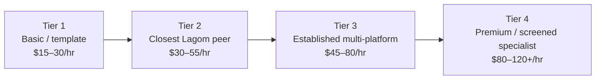

# Lagom Naturals Freelancer Replacement Pricing Benchmark

## Executive summary

**Bottom line:** if Lagom Naturals replaced its current developer with another individual freelancer who genuinely matched the requested calibration—self-taught or nontraditional, early in professional freelancing but no longer a beginner, multiple completed projects, capable of React plus WordPress/PHP/API/database work, and comfortable using modern AI coding tools—the most realistic **global marketplace asking-rate band is about $30–$55/hour**, with a particularly credible cluster around **$35–$50/hour**. More-established multi-platform freelancers commonly move into roughly **$45–$80/hour**, while screened/premium specialists begin around **$80/hour and can exceed $120/hour**. Upwork itself currently places “intermediate” talent broadly at $25–$60/hour; Contra places junior React developers at $30–$50 and mid-level React developers at $50–$80; actual matching Upwork profiles observed in this study ranged from $25 to $60 before moving into clearly more-established territory. citeturn14search1turn15search13turn5search1turn5search5turn6search3turn5search0

That makes **Lagom's current $50/hour rate Competitive to Typical—not unusually cheap and not high**. It sits toward the upper half of the closest global peer band and at the lower edge of the more-established band. A buyer deliberately searching globally can absolutely find credible developers below $50; a buyer can also readily find appropriate candidates at $50–$60 and considerably above. The evidence therefore does **not** support describing $50 as a bargain-market rate. It does support describing it as a reasonable rate for a broad generalist who can deliver custom work rather than template-only WordPress. citeturn14search1turn14search2turn12view1turn15search12

The calibration used here is the one supplied for this study: a self-taught, relatively new but proficient freelancer, heavily AI-assisted, with multiple completed projects and demonstrated React, JavaScript, WordPress/WooCommerce, PHP, custom plugin/admin, REST API, Git, dashboard/CRM, performance, SEO and database/integration capabilities—not a senior/principal developer and not an absolute beginner. fileciteturn0file0

| Question | Research conclusion |
|---|---|
| **Realistic closest-peer hourly rate** | **$30–$55/hr**, with **$35–$50/hr** the strongest practical target band. |
| **Current $50/hr** | **Competitive / Typical**, toward the upper half of Tier 2; not objectively “low” in the global freelancer market. |
| **More-established replacement** | Roughly **$45–$80/hr**. |
| **Premium/vetted specialist** | Roughly **$80–$120+/hr**; Codeable explicitly publishes $80–$120/hr. citeturn13view0 |
| **Website + commerce closest-peer project** | **$3,500–$6,500**, sometimes higher for genuinely headless/custom commerce. |
| **Custom WP admin/CMS** | **$1,750–$3,750** for the closest tier; $3,500–$6,500 once workflows/integrations become extensive. |
| **Scheduling continuation scope** | **$1,500–$3,000** is credible; greenfield is more like **$3,000–$5,500**. |
| **CRM MVP** | Roughly **$2,500–$5,000** for a proper initial operational MVP. |
| **Simple / standard integration** | Roughly **$400–$1,000 / $1,000–$2,250** in the closest tier. |
| **SEO / performance implementation** | Roughly **$600–$1,500** for substantial implementation rather than a cache-plugin tune-up. |
| **Technical audit/report** | Roughly **$300–$900** for closest peers; deeper code/data analysis can reach $1,500+. |
| **Initial takeover/onboarding** | Usually **$750–$2,250** for a comparable freelancer if the codebase is reasonably organized; materially more if several repositories/environments are poorly documented. |
| **Overall Lagom fixed pricing** | **Mostly Competitive to Typical.** None of the current ranges is plainly “very low.” Some upper bounds are high for a narrow interpretation of the service but normal for the deeper scope described. |

A major reason Fiverr can create the impression that custom development costs only $50–$500 is **package compression**: the headline is often a one-page frontend, UI mock-up, one API endpoint, a handful of bug fixes, or a deliberately constrained MVP. For example, a $40 CRM/dashboard offer examined here is explicitly frontend-only with no database; the same seller charges $190 for authentication plus Supabase CRUD and $450 for roles, exports and analytics. Another $80 “React dashboard with Supabase” package explicitly excludes the backend. At the other end of the same Fiverr market, a seller charges $600 for a two-page Supabase admin, $1,500 for five pages with CRUD, and $3,500 for a ten-page system with roles and workflows. citeturn18search1turn18search4turn18search0

**Direct answer to the final question:** a Lagom owner searching Fiverr, Upwork and similar platforms could find a cheaper replacement at $25–$35/hour, but matching the current developer's breadth, custom-development capability, independence and end-to-end working style without dropping substantially toward template work would realistically put the search around **$35–$55/hour**, with **$40–$50/hour a very plausible hiring outcome**. A candidate with substantially more marketplace history and production depth is more likely to cost **$50–$80/hour**. At $50/hour, the current developer is therefore **market-competitive, not conspicuously underpriced**. Platform fees also make a nominally identical marketplace freelancer cost the client more: Fiverr currently adds 5.5% to purchases, while Upwork's Basic client fee can be up to 7.99%, or 3% for eligible U.S. bank payments, plus a $0.99–$14.99 contract-initiation fee. citeturn15search0turn14search0turn14search7

The ranges above are an analyst synthesis of the profile sample and official marketplace benchmarks, not a claim that every developer inside a tier charges the same rate. citeturn14search1turn15search13turn12view1turn13view0

## Scope, methodology, and market context

### Calibration and research objective

The study deliberately does **not** compare Lagom's developer primarily with agencies, enterprise consultancies, staff/principal engineers or specialist veterans. The target is an individual freelancer who is already capable of useful custom production work but remains comparatively early in the professional freelance career. The current-developer profile, technologies and Lagom service scopes were taken directly from the supplied research brief. fileciteturn0file0

The study also separates three things that marketplace search pages routinely blur together:

**Headline price** is the lowest selectable package or “from” price.  
**Comparable price** is what the advertised package actually costs once its scope resembles the Lagom work.  
**Analyst project estimate** is my market estimate for the stated Lagom scope, informed by listings, rates and an independent implementation-work breakdown rather than by dividing a project price by an hourly rate.

All web research was accessed **September 28, 2026**. Marketplace pages are dynamic, so prices, seller levels, ratings and package definitions can change after that date.

### Evidence base

| Evidence class | Sample used | What was measured | Principal strength | Principal limitation |
|---|---:|---|---|---|
| Fiverr/Fiverr Pro individual listings | **18 core listings**, plus additional screening results | Public packages, pages/screens, delivery, revisions, frontend/backend, source code, deployment, seller signals | Shows exactly what low headline prices buy | Search ranking is not random; some sellers have limited history |
| Upwork individual profiles | **12 closely reviewed profiles**, plus additional screened profiles | Public hourly rate, geography, JSS/badges, jobs/hours when exposed, stack and relevant work | Strongest hourly-rate evidence | Profile asking rate is not necessarily every contract's realized rate |
| Other freelancer marketplaces | Contra, PeoplePerHour, Guru, Freelancer, Codeable, Arc, Braintrust | Rates, projects, current offers, platform positioning | Checks whether Fiverr/Upwork are unusual | Some publish generic ranges rather than transactions |
| Marketplace official pricing guidance | Upwork, Contra, Codeable, Arc | Current platform ranges and cost guidance | Primary/official evidence | Category definitions are broad |
| AI-development research | METR, GitHub research, recent academic preprints | Productivity/quality outcomes of AI coding | Tests the assumption that AI necessarily means lower effort/cost | Results are setting-dependent and evolving rapidly |

The sample was intentionally **anti-biased**. It includes legitimate observations below $50, around $50 and above $50 rather than choosing only expensive freelancers. Upwork, for example, currently has broad custom developers at $25–$35, relevant profiles at $40–$55, and stronger or more established profiles at $50–$60+. citeturn6search16turn5search1turn6search13turn5search5turn6search3turn5search0

Upwork's own 2026 guide illustrates why a single category average is inadequate. It labels intermediate freelancers generally at $25–$60/hour; lists web development at $15–$50, WordPress at $15–$28, API development at $20–$40 and full stack at $16–$35; yet its dedicated React cost page reports $51–$75/hour. Its separate React.js guidance allows $15–$150 depending on capability. These are not contradictions so much as evidence that **skill labels alone fail to capture scope and freelancer positioning**. A developer combining React, custom WordPress/PHP, APIs, admin tools and independent project ownership should not be priced from the generic $15–$28 WordPress bucket alone. citeturn14search1turn14search2turn14search6turn14search9

### AI assistance is not a valid automatic discount

The live marketplace sample contains freelancers openly marketing Lovable, Bolt, v0, Cursor, Codex, Claude, Supabase and “vibe coding.” Their prices overlap conventional freelancers rather than forming a distinct low-price market. Sahed, for example, publicly advertises $45/hour while describing AI-assisted custom React/Node/Supabase workflows; Mohsin listed $35/hour; other AI-first Fiverr offers use very cheap starter packages but narrow those packages to quick fixes or small MVPs. citeturn11search9turn11search16turn18search2

The research literature likewise does not support a blanket “AI makes development X% cheaper” assumption. METR's randomized study of experienced open-source developers on familiar repositories found early-2025 AI tools made completion **19% slower** in that setting. METR said in February 2026 that newer tools likely produced more speedup, but its later experimental data had selection and measurement problems too severe for a firm estimate. GitHub's controlled study of 202 experienced developers, meanwhile, reported better functional and code-review outcomes with Copilot. A very recent 2026 preprint with 30 participants reported faster task completion under vibe coding but worse maintainability and more security vulnerabilities. These results point to **task-dependent productivity, not an across-the-board rate discount**. citeturn16search1turn16search0turn16search9turn16academia25

For Lagom specifically, the reasonable inference is that AI assistance can be valuable on greenfield UI, scaffolding, repetitive CRUD and research, while code comprehension, integration correctness, debugging, QA and takeover of an existing mixed React/WordPress codebase remain substantial human work. That inference is also consistent with research finding that benchmark-passing AI patches do not always meet real maintainers' merge standards. citeturn16search14

## Fiverr market findings

### What the listings actually sell

The following are **public marketplace prices**, not inferred hidden quotes. “Not shown” means the search/page snapshot did not expose the field, rather than an invented value.

| Individual listing | Seller signals | Public package / delivery | What is actually included or excluded | Comparison class |
|---|---|---|---|---|
| [Janib Soomro — custom WordPress REST API](https://www.fiverr.com/janibsoomro/make-custom-wordpress-rest-api) | Pakistan; 4.7/5, 248 reviews in search snapshot; PHP/Python, WP/Shopify APIs | Public package price not exposed | Custom endpoints, Sheets/Woo sync, dropshipping/API work, deployment/docs; genuinely code-level | **Custom quote required** citeturn0search0 |
| [Jose M — WordPress plugin](https://www.fiverr.com/jdmarin/develop-your-wordpress-plugin) | Fiverr Pro; 4.9/5, 17 reviews | **$80**, 7 days; up to 5 actions/requirements | Custom plugin + source; much smaller than a complete admin/business system | **Partial match** citeturn0search4 |
| [Dominik Rauch — WordPress plugin](https://www.fiverr.com/qualmy91/develop-a-custom-wordpress-plugin) | 5.0/5, 13 reviews; Woo/API/performance skills | **$75 Basic**, 3 days | Small custom-plugin starting package; broader API capability advertised | **Entry / partial** citeturn0search6 |
| [Ric — custom WordPress plugin](https://www.fiverr.com/mdridipu/custom-wordpress-plugin-development-clean-and-scalable-code) | Seller metadata not fully exposed | **$80 / $120 / $190**; 5/7/14 days; 3/6/9 revisions | Custom plugin work, with APIs/webhooks depending on scope | **Partial match** citeturn0search7 |
| [JH Fahim — WP/Woo REST API](https://www.fiverr.com/itfahimbd/custom-wordpress-rest-api-and-woocommerce-api-integration) | 5.0/5, 4 reviews | **$60**, 2 days | **One API** in starter package; source code; seller advertises broader REST experience | **Headline / partial** citeturn0search15 |
| [Tonay / Tech_plex — full-stack PHP/Laravel/React](https://www.fiverr.com/tech_plex/be-full-stack-web-developer-for-website-development-backend-frontend-developer) | Level 2; about 5.0/5, 372 gig reviews; public hourly **$35** | **$80**, 4 days, unlimited revisions | One responsive application/page at starter level; full-stack capability exists but starter is deliberately narrow | **Entry price; seller itself is relevant** citeturn1search0turn4view6 |
| [Akib — full-stack web development](https://www.fiverr.com/wix_buddy/do-landing-page-website-figma-ui-ux-design-and-development) | Bangladesh; Level 2; profile 4.9/5 with 2,000+ reviews; public hourly **$60** | Starter around **$130**, 7 days; observed buyer work in €600–€800 range over ~3 weeks | React/Next/PHP/Node, ecommerce, APIs, responsive work and SEO; starter is one-page scale | **More-established comparison** citeturn1search6turn4view8 |
| [Anshu Raj — Next.js/full-stack](https://www.fiverr.com/anshuopinion/build-website-using-next-js) | India; Level 2; 4.9/5, 112 reviews; 170+ projects; advertises Bolt, v0, Supabase, Codex | Package price not exposed in snapshot; simple Figma→React work described as 1–2 days | MERN/Next/Express plus explicit modern AI workflow | **Strong capability, more established** citeturn1search19turn4view10 |
| [Basit — WordPress performance](https://www.fiverr.com/basitbuilds/optimize-wordpress-performance-caching-and-load-time) | Seller rating not exposed in snapshot | **$65 Basic**, 2 days, 1 revision | Audit, caching/images and report; deeper Redis/PHP work is outside the starter | **Headline / partial** citeturn1search13 |
| [Dejan Petkovic — Supabase admin dashboard](https://www.fiverr.com/alede_digital/build-a-custom-admin-dashboard-with-supabase) | Serbia; member since July 2026; Next/React/Supabase/Postgres | **$600 / $1,500 / $3,500**; 10/21/30 days; 2/5/10 pages; 1/2/3 revisions | Responsive; source included; auth; Standard adds CRUD; Premium adds roles/workflows; APIs and deployment support available | **Strong comparison** citeturn18search0 |
| [Mukthar — React CRM/dashboard](https://www.fiverr.com/meemflow/build-a-custom-saas-admin-panel-dashboard-or-crm-in-react) | Nigeria; joined Feb. 2026; Lovable; explicitly “AI-assisted workflows” | **$40 / $190 / $450**; 2/5/10 days; 1/5/10 pages | $40 = **UI only, no DB**; $190 = Supabase/auth/CRUD; $450 adds roles, exports, analytics; source included | **Excellent headline-price case** citeturn18search1 |
| [Ryan Kalansi — internal system](https://www.fiverr.com/ryan_kalansi/build-a-custom-internal-dashboard-or-web-app-with-react-and-nextjs) | Indonesia; member since 2023; React/Next/Supabase; states solo 7-module ERP built in <6 weeks | **$100 / $250 / $500**; 7/14/21 days; 3/7/10 pages; 2/3/5 revisions | Login, roles, data; higher packages add multi-role/complex relations; responsive. **Source is not included by default.** | **Strong functional comparison, unusually low pricing** citeturn18search3 |
| [Aun Ali — React/Supabase dashboard](https://www.fiverr.com/aunali72/build-a-modern-react-admin-dashboard-with-supabase-backend) | Pakistan; member since Oct. 2024 | **$80 / $130 / $200**; 3/5/10 days; 1/5/10 pages | Basic is frontend-oriented; higher tiers add API/auth and Supabase functionality | **Partial / low-cost peer** citeturn2search10 |
| [Siraj Ahmed — React/Supabase dashboard](https://www.fiverr.com/samadjawad992/build-a-custom-react-dashboard-with-supabase-backend) | Portfolio shows 2026 work; seller metadata otherwise limited | **$80**, 7 days, 2 pages, 1 revision | Explicitly **static/mock frontend data; no backend included** | **Headline price** citeturn18search4 |
| [Khizer Awan — admin dashboard](https://www.fiverr.com/khizerawan57/build-an-admin-dashboard-with-react-vue-or-firebase-backend) | Advertises ~1.5 years full-stack experience | **$80**, 5 days, 2 revisions, up to 3 pages | Login + CRUD/admin scope; a better early-stage analogue than template sellers | **Partial comparison** citeturn2search13 |
| [Sahed — AI-assisted React/Node site](https://www.fiverr.com/sahedalomsumit/build-a-custom-coded-website-with-react-and-nodejs-using-vibe-coding) | Level 2; public **$45/hr**; advertises React/Node/REST/Supabase and AI-assisted workflow | About **$290** for landing-page package, 4 days | Custom code, responsive work and source; starter remains landing-page scale | **Close hourly analogue / partial fixed scope** citeturn11search9 |
| [Noman Yousaf — Lovable/React/Supabase rescue](https://www.fiverr.com/chaudharynom933/build-and-fix-your-lovable-ai-app-using-react-and-supabase) | Pakistan; member since 2019; 5+ years claimed | **$40 / $140 / $340**; 2/4/7 days; 1/2/4 revisions | Quick fixes → fixes + feature + Supabase cleanup → app audit/rebuild broken areas and Supabase optimization | **Useful takeover evidence** citeturn18search2 |
| [David G — React/Supabase AI dashboard](https://www.fiverr.com/srdeivid/a-professional-admin-dashboard-with-react-and-supabase) | Spain; member since Sept. 2024; explicitly Lovable + Claude AI | **$60 Basic**, 4 days, one screen/feature | Supabase DB/auth, API, deployment, responsive UI and source advertised; larger work requires custom offer | **AI-assisted headline / partial** citeturn18search5 |

Two Fiverr agency/Pro results were inspected but **excluded from the individual-freelancer benchmark**, including a roughly $1,495 headless WordPress/React package and a $995 simple WordPress-plugin package, because the research brief explicitly requires individual-freelancer pricing rather than agency pricing. citeturn1search1turn0search1

### What $300, $800, $1,500 and $3,000+ actually buy

**Around $300:** the credible market is mostly a good landing page, a handful of screens, a constrained feature, a functional but small CRUD/admin MVP, or a rescue/fix package—not a fully equivalent Lagom commerce site or production CRM. Sahed lists a custom-coded landing page around $290; Noman's $340 package is a *repair/audit* of an existing AI-generated app; Mukthar's $190 level provides a basic working Supabase CRUD panel while $450 adds broader business features. citeturn11search9turn18search2turn18search1

**Around $800:** the buyer can reasonably expect a substantive small custom module, several functional admin screens, a modest web app or a substantial chunk of a larger build from a lower-cost global seller. Dejan's deliberately more conservatively priced $600 package is still only a two-page dashboard, while one more-established Fiverr seller has customer work visible in the €600–€800 range over approximately three weeks. Scope, not the sticker price, is the important comparison. citeturn18search0turn4view8

**Around $1,500:** the market starts to contain genuinely useful multi-feature systems. Dejan's exact $1,500 package includes a five-page Supabase admin system with authentication and CRUD and advertises 21-day delivery. A PeoplePerHour full-stack seller advertises £1,145 while explicitly stating **$1,500 is the base MVP price** and that most such MVPs take four to five weeks, despite the platform's top-level “4 days” field. That mismatch is particularly strong evidence that marketplace delivery labels and headline prices need to be read carefully. citeturn18search0turn17search7

**At $3,000+:** custom workflows, larger multi-role systems, a more serious CRM/internal tool or broader ecommerce integration become much more realistic. Dejan's $3,500 package has ten pages, authentication, roles, workflows and CRUD with a 30-day advertised schedule. This is much closer to the scale of real operational software than a $40–$100 Fiverr starter. citeturn18search0

The crucial Fiverr finding is therefore not that the platform is “expensive” or “cheap.” It is that **both claims can be manufactured by selecting the wrong package**. Fiverr has extremely inexpensive working developers, but the cheapest visible package very frequently buys a different product from the one Lagom would need.

## Upwork and other freelancer marketplaces

### Actual Upwork profiles

The table intentionally contains cheaper, around-$50 and above-$50 examples. Profiles with long careers are marked as more established so they do not improperly redefine the primary peer tier.

| Individual profile | Public rate | Marketplace evidence | Relevant capability | Calibration |
|---|---:|---|---|---|
| [Rahul R](https://www.upwork.com/freelancers/~01c71d91846923572c) — India | **$25/hr** | Rising Talent; 100% JSS shown; 16 jobs | Custom WP tools, React/Node/Firebase, dashboards | **Low end / reasonably relevant** citeturn6search16 |
| [Stanislav S](https://www.upwork.com/freelancers/~01f70e7109fcf1bd85) — Ukraine | **$30/hr** | Rising Talent; 6 jobs | WP/Woo, performance/SEO, React integration, CRM/payment APIs, Git; claims 4+ years | **Strong lower comparison** citeturn5search1 |
| [Sima A](https://www.upwork.com/freelancers/~013f27cada381e81ce) — Romania | **$40/hr** | Rising Talent | React/Next, WordPress, Firebase; catalog full-stack project from $150 | **Close comparison** citeturn5search5 |
| [Chiran R](https://www.upwork.com/freelancers/chiran) — Sri Lanka | **$35/hr** | 92% JSS; 47 jobs; 239 hours | React/Next/Node/Nest, Supabase/Firebase, APIs, Git | **Close-to-established** citeturn6search13 |
| [Matthew G](https://www.upwork.com/freelancers/~0194f7d3ff409283b2/) — U.S. | **$55/hr** | 18 jobs; 351 hours; 50% JSS in snapshot | React/Node/UI/APIs plus PHP/WordPress; GitHub activity since 2019 | **Relevant above-$50 example, weaker JSS** citeturn6search3 |
| [Ryan T](https://www.upwork.com/freelancers/~01a376c008590030bd) — U.S. | **$60/hr** | 9 jobs; 7 hours on profile | Headless WP, REST/GraphQL, PHP/JS/Nuxt, page speed; 5+ years claimed | **More established** citeturn5search0 |
| [Adil A](https://www.upwork.com/freelancers/~0145752d744a7849d3) — Pakistan | **$40/hr** | 100% JSS; 17 jobs; 2,395 hours | React/Next/Node/Supabase/Laravel; 9+ years claimed | **Established, useful rate boundary** citeturn5search9 |
| [Okan F](https://www.upwork.com/freelancers/~01ac600699e8280439) — Turkey | **$50/hr** | 100% JSS; 36 jobs; 254 hours | Broad full-stack work; 10+ years claimed | **Established at exactly $50** citeturn5search4 |
| [Nikul L](https://www.upwork.com/freelancers/~017c5f3f0cc8a0a8aa) — India | **$25/hr** | 100% JSS; 44 jobs; 299 hours | React/Node/PHP/WP/Woo, custom plugins, APIs, Git/AWS; 7+ years | **Established but inexpensive** citeturn6search2 |
| [Sheheryar K](https://www.upwork.com/freelancers/sheheryaralamkhan) — Pakistan | **$25/hr** | 100% JSS; Top Rated; 61 jobs; 844 hours | WordPress, React Native, Angular, API, PHP, Woo, CRM; 12+ years claimed | **Strong proof that experience can still be <$50 globally** citeturn6search1 |
| Dimitrios — Greece | **$55/hr** | Top Rated; 100% JSS; 51 jobs; 1,624 hours | WP/Woo plus AI; 15+ years claimed | **Senior/upper boundary only** citeturn6search6 |
| David C — Serbia | **$50/hr** | 6 jobs; 279 hours | WordPress, React, custom development and automation; 14+ years claimed | **Established boundary, not primary peer** citeturn5search8 |

This sample demonstrates why the strongest conclusion is **not** “$50 is cheap.” Experienced global developers with solid Upwork records can list at $25–$40. At the same time, more directly React-oriented, U.S.-based or wider-scope developers frequently appear at $50–$60 and beyond. The primary peer band therefore overlaps $50 rather than sitting entirely above it. citeturn6search1turn6search2turn5search5turn6search3turn5search0

### Other marketplaces as cross-checks

| Market | Current observed evidence | How much weight it deserves |
|---|---|---|
| **Contra** | WordPress page: entry $20–$40/hr, experienced $50–$80, specialist $80–$150; basic WP projects $2k–$5k. React page: junior $30–$50, mid $50–$80, senior $80–$150. citeturn12view1turn15search13 | **High** as a directional cross-check; aligns well with the tier structure. |
| **PeoplePerHour** | £25 for one tightly focused React/Next/Supabase hour; another full-stack offer publicly lists £1,145 but states $1,500 base MVP and four-to-five-week normal duration. citeturn17search13turn17search7 | **High** for illustrating package-vs-real-scope differences. |
| **Guru** | Official API-integration guidance: $25–$50 entry, $50–$100 mid-level, $100–$150+ expert. citeturn15search12 | **Moderate/high** for integration pricing. |
| **Freelancer.com** | Current jobs show extremely low budgets, including $30–$250 for substantive WordPress/backend work. One broad WordPress/API/performance project was awarded to a new freelancer for $30 while the average of 91 bids was $174; the bidder explicitly said the low price was to obtain reviews. citeturn17search8 | **Market-floor evidence only.** Buyer budgets and review-building bids are not equivalent to peer-market value. |
| **Codeable** | Carefully screened WordPress experts at **$80–$120/hr**; Codeable says its displayed project total includes a 17.5% fee. citeturn13view0 | **Premium upper boundary**, not Lagom's primary peer group. |
| **Arc** | Current official range across its pre-vetted freelance network is **$15–$110+/hr**, with rate set by freelancer; its own page discusses large geographic rate differences. citeturn13view2turn13view1 | **Upper/quality-screened context**, too broad for the primary benchmark. |
| **Braintrust** | Public support material documents a 15% client fee, but a usable public rate table for this exact freelancer tier was not available. citeturn17search19turn17search21 | **Excluded from quantitative rate benchmark** rather than inventing a number. |

The most defensible four-tier hourly model from all of these sources is:

| Peer tier | Realistic global freelance range | Interpretation |
|---|---:|---|
| **Basic / Entry** | **$15–$30/hr** | Themes/templates, page builders, basic frontend, routine maintenance; not the main comparison. |
| **Starting Proficient AI-Assisted Developer** | **$30–$55/hr** | **Primary Lagom peer group.** Multiple real projects, broad custom-development ability, but not senior. |
| **More Established Multi-Platform Freelancer** | **$45–$80/hr** | More production history, stronger backends/integrations, larger client record. |
| **Senior / Premium / Screened** | **$80–$120+/hr** | Upper boundary; Codeable/Contra specialist territory rather than Lagom's primary peer. |

**Verdict on $50/hour: Competitive / Typical.** It is higher than a large pool of global $25–$40 developers but squarely inside the credible range for broader React-plus-backend/custom-WordPress work. It is not high enough to be considered a premium freelancer rate. citeturn14search1turn15search13turn12view1turn13view0

## Service pricing and delivery benchmark

The following fixed-price bands are **analyst estimates**, not claims that every marketplace seller quotes the same number. They synthesize the actual package/profile evidence above with an independent scope decomposition. Engineering hours were estimated from the implementation tasks themselves; they were **not calculated by dividing project price by hourly rate**.

| Lagom-type service | Low-cost freelancer | **Closest peer market** | More-established freelancer | Realistic engineering effort | Current Lagom range | Evidence-based verdict |
|---|---:|---:|---:|---:|---:|---|
| **Website + Commerce** — custom responsive redesign, React frontend, WP/Woo connection, core/shop/product UX, QA/deploy | $1,500–$3,500 | **$3,500–$6,500** | $6,000–$10,000+ | **80–140 h greenfield**; roughly 3–6 elapsed weeks | **$4,500–$6,500** | **Competitive / Typical.** Upwork currently gives $2,500–$8,000 even for conventional Woo ecommerce and $3,000–$10,000+ for custom themes/plugins; Lagom adds React/integration work. citeturn14search5 |
| **WordPress Admin + CMS** — custom admin, structured fields/content, plugins, workflows, APIs | $750–$1,750 | **$1,750–$3,750** | $3,500–$6,500 | **45–85 h**; ~2–4 weeks | **$2,500–$4,500** | **Competitive**, becoming **High** only if scope is merely basic CPT/field setup. Custom plugins/APIs justify the upper end. citeturn18search0turn14search5 |
| **Scheduling + Staff Operations, greenfield** | $1,500–$3,000 | **$3,000–$5,500** | $5,000–$9,000 | **70–120 h**; ~3–6 weeks | n/a as current range is continuation | Custom employee/shift/publish/permission/export logic is a business app, not a scheduling-SaaS setup. Dashboard/MVP evidence supports materially more than a Fiverr starter. citeturn18search0turn17search7 |
| **Scheduling continuation** | $750–$1,500 | **$1,500–$3,000** | $2,750–$5,000 | **30–60 h**; ~1.5–3 weeks | **$1,750–$3,000** | **Typical.** Existing architecture meaningfully reduces greenfield work if it is sound. |
| **CRM + Sales Operations MVP** — accounts, reps, activities, auth, Supabase/data, core reporting | $1,000–$2,500 | **$2,500–$5,000** | $5,000–$9,000+ | **60–110 h**; ~3–6 weeks | **$2,500–$4,000** initial phase | **Competitive**, especially at the bottom; a properly scoped $2.5k CRM is not expensive in this peer tier. citeturn18search1turn18search0turn17search7 |
| **Simple integration** — one straightforward API/webhook with known docs and limited error handling | $150–$500 | **$400–$1,000** | $800–$1,750 | **6–14 h**; ~1–3 working days | **$500–$1,000** | **Typical.** $60 Fiverr API packages exist, but commonly represent one narrow endpoint. Guru puts entry API developers at $25–$50/hr. citeturn0search15turn15search12 |
| **Standard production integration** — auth, mapping, errors, retries/testing, UI/admin effects | $500–$1,200 | **$1,000–$2,250** | $2,000–$4,000 | **18–35 h**; ~3–8 working days | **$1,000–$2,000** | **Typical / Competitive.** |
| **Complex sync/integration** — bidirectional synchronization, jobs/webhooks, reconciliation, edge cases | $1,500–$3,000 | **$2,500–$5,000** | $4,500–$8,000+ | **45–90 h**; ~2–5 weeks | No current Lagom band | A separate category should be added rather than forcing these jobs into “standard integration.” |
| **SEO + Performance implementation** — CWV, code/frontend optimization, schema, technical SEO, accessibility | $150–$500 | **$600–$1,500** | $1,200–$3,000 | **12–30 h**, occasionally 40+; ~2–7 working days | **$750–$1,750** | **Typical**, with the upper end **slightly high** for a straightforward WP site but appropriate for code-level React/Woo/server work. Fiverr's $65 package is cache/image/audit scale; current Freelancer projects for deeper WP/Woo performance use materially larger budgets. citeturn1search13turn17search1turn17search9 |
| **Audit / Analysis / Reporting** | $100–$300 | **$300–$900** | $750–$1,500+ | **6–18 h**; ~2–5 business days | **$350–$1,250** | **Typical at the low/middle; High at $1,250 if report-only.** The upper range is defensible for code inspection, ecommerce/data analysis and a detailed implementation roadmap. citeturn17search13turn18search2 |

### Advertised delivery versus actual engineering time

Fiverr's delivery field is a **calendar promise for the package**, not an engineering-hours estimate. The distinction is visible in the data. A $40 dashboard UI says two days, while Dejan's much more complete $1,500 admin system says 21 days and his $3,500 system says 30. Ryan advertises 7, 14 and 21 days as scope increases. The PeoplePerHour MVP example is even more revealing: its platform header says four days, but the seller's own scope text says most base MVPs take **four to five weeks**. citeturn18search1turn18search0turn18search3turn17search7

A reasonable Lagom planning model is therefore:

| Scope | Marketplace headline frequently seen | More realistic planning assumption |
|---|---|---|
| Landing page / Figma implementation | 1–4 days | **1–5 working days**, depending on polish and revisions |
| Small plugin / one API / contained feature | 2–7 days | **2–8 working days** |
| Small functional CRUD/dashboard | 5–14 days | **1–3 weeks** |
| Multi-role admin/internal tool | 10–30 days | **3–6 weeks** |
| CRM/business MVP | “4–10 days” appears in low-end offers | **3–6+ weeks** for a production-useful first phase |
| Custom React + Woo/WordPress commerce redesign | Frequently requires custom quote | **3–6+ weeks**, longer where content/migration/design approval is unresolved |

Those calendar estimates include normal iteration, QA and client review; they are not equivalent to continuous eight-hour engineering days.

## Replacement and takeover economics

Replacing an existing developer is not the same transaction as commissioning a clean new landing page. A competent replacement would normally need to understand the current repository, local environment, React architecture, WordPress/WooCommerce instance, custom plugins/admin workflows, scheduling code, CRM/Supabase work, API/data flows, deployment procedures and whatever documentation exists. The market explicitly contains sellers offering existing-project integration and AI-app rescue rather than only greenfield development: Ryan says he works with both existing and greenfield systems, while Noman's packages progress from quick repair to full app audit and rebuild of broken React/Supabase areas. citeturn18search3turn18search2

### Realistic takeover effort

For a reasonably organized Lagom codebase, my implementation-based estimate is:

| Takeover activity | Analyst effort estimate |
|---|---:|
| Repository access, dependency/install and local/staging setup | 3–6 h |
| React architecture, routes, state/data patterns and build/deploy review | 4–8 h |
| WordPress/WooCommerce configuration and custom-plugin/admin inspection | 4–8 h |
| Scheduling system/workflows | 3–6 h |
| CRM/Supabase/auth/database review | 3–6 h |
| APIs, credentials, data flows, deployment and documentation mapping | 3–7 h |
| **Normal initial takeover total** | **20–40 h** |
| **Poorly documented / several broken environments** | **35–60+ h** |

These are analyst estimates based on the specified components, not hours reverse-engineered from a project price.

The associated **peer-market takeover budget is roughly $750–$2,250** for an organized project and can move toward **$1,500–$4,000** if a more-established freelancer is hired or the handoff exposes missing credentials, obsolete dependencies, undocumented business logic or broken environments. A very low Fiverr rescue package can solve a contained fault—Noman's published $340 package is a good example—but it should not be interpreted as proof that a stranger can fully learn several interconnected Lagom systems for $340. citeturn18search2turn17search13

The transition also creates an important **continuity premium**. Even a slightly cheaper $35–$40 replacement may initially cost more in total because part of its first engagement produces understanding rather than visible features. This is one reason that comparing only nominal hourly rates understates replacement economics.

Platform charges modestly increase that gap. A freelancer listed at **$50/hour** costs an eligible U.S. Upwork client approximately **$51.50/hour at a 3% marketplace fee**, or as much as roughly **$54/hour at 7.99%**, before the small initiation charge. On Fiverr, a $50-equivalent order incurs the standard 5.5% service fee, and purchases below $200 also currently receive the additional $3.50 fee. citeturn14search0turn14search7turn15search0

## Lagom pricing assessment and recommended system

### Current pricing verdict

| Current Lagom price | Rating versus comparable individual freelancers | Interpretation |
|---|---|---|
| **$50/hour** | **Competitive / Typical** | Correctly placed near the upper half of starting-proficient global peers; below premium talent. |
| **$2,000 / 40 prepaid hours** | **Typical** | It is exactly $50/hour, so it is reserved prepaid capacity, **not a price discount**. |
| **Website + Commerce $4,500–$6,500** | **Competitive / Typical** | Appropriate if it really includes custom responsive React + WordPress/Woo + commerce UX + QA/deployment. |
| **WordPress Admin + CMS $2,500–$4,500** | **Competitive to High** | Strongly defensible for custom plugins/workflows/APIs; upper end is high for simpler admin configuration alone. |
| **Scheduling continuation $1,750–$3,000** | **Typical** | Good fit for an existing architecture; would be too low for a fully greenfield system of the described breadth. |
| **CRM MVP $2,500–$4,000** | **Competitive** | Lower half of a defensible peer band for a working operational MVP. |
| **Simple integration $500–$1,000** | **Typical** | Sensible once testing/error handling is part of the work. |
| **Standard integration $1,000–$2,000** | **Typical / Competitive** | Appropriate for ordinary production integration. |
| **SEO + Performance $750–$1,750** | **Typical to High** | High versus Fiverr “speed optimization” starters, but not high for genuine code-level technical remediation. |
| **Audit / Analysis / Creative $350–$1,250** | **Typical to High** | $350–$900 is directly marketable; $900–$1,250 should correspond to deeper analysis and a professional actionable deliverable. |

The important conclusion is that **Lagom's fixed prices are not systematically under market**. They are mostly well positioned for a capable early-stage freelancer. Several are low compared with experienced Western or screened specialists, but those specialists are specifically outside the primary calibration. Conversely, Lagom is materially more expensive than Fiverr's lowest-price global offers—and that is not automatically a problem because those offers often have materially narrower deliverables. citeturn18search0turn18search1turn14search5turn12view1

### Recommended updated pricing architecture

I would **retain the $50/hour standard rate rather than cutting or materially increasing it on the basis of this study**. The evidence does not justify calling $50 underpriced, but it also gives no reason to reduce it when the developer is handling genuinely custom, cross-platform work.

A more defensible client-facing schedule would be:

| Service | Recommended Lagom band | Change from current |
|---|---:|---|
| **Standard development / debugging** | **$50/hr** | Keep |
| **40-hour prepaid/reserved-capacity block** | **$2,000** | Keep, but call it prepaid capacity rather than a discount |
| **Website + Commerce** | **$4,500–$7,000** | Slightly widen upper end for truly headless/custom commerce |
| **WordPress Admin + CMS** | **$2,250–$4,250** | Slightly tighten; quote above this for unusually extensive workflows |
| **Scheduling continuation** | **$1,750–$3,250** | Minor widening |
| **Scheduling greenfield** | **$3,500–$5,500+** | Add a separate category |
| **CRM MVP phase** | **$3,000–$5,000** | Raise the lower and upper bounds modestly as scope becomes production-oriented |
| **Simple Integration** | **$500–$1,000** | Keep |
| **Standard Integration** | **$1,000–$2,250** | Keep / modest widening |
| **Complex Integration / synchronization** | **$2,500–$5,000+** | Add category rather than squeezing into “standard” |
| **SEO + Performance — standard** | **$750–$1,500** | Slightly tighten |
| **SEO + Performance — deep technical** | **$1,500–$2,500+** | Add separate tier for backend/server/database/CWV work |
| **Light audit / analysis** | **$350–$900** | Clarify scope |
| **Deep technical/ecommerce audit** | **$900–$1,500** | Separate premium audit tier |
| **Takeover / codebase discovery** | **$750–$1,500 initial assessment**, then $50/hr | Add explicit handoff product |

For fixed-price work, the more important improvement is **scope discipline**, not a higher sticker price. A $4,500 website can be healthy if page count, products/content migration, design revisions, ecommerce behavior, API work, accessibility, performance targets and launch responsibilities are explicitly bounded. A poorly bounded $6,500 project can still be underpriced. Marketplace sellers themselves repeatedly require buyers to contact them before ordering larger systems because the visible packages do not cover arbitrary workflows or integrations. citeturn18search0turn18search2turn18search6

### Uncertainties and gaps

The findings should not be over-interpreted as a precise statistical distribution. Fiverr and Upwork search results are ranked and dynamic rather than random samples; public rates are asking rates; reviews may apply to an entire seller profile rather than the specific gig; and project listings do not expose all private custom offers. Geographic cost differences remain very large, which is why credible developers with extensive histories can still list at $25–$40 while others charge $60+. citeturn13view1turn14search1

The hardest characteristic to benchmark directly is the requested combination of **“self-taught + starting proficient + multiple real projects + broadly multi-platform + heavily AI-assisted.”** Marketplaces rarely publish education/background and AI workflow together with enough project history to classify sellers perfectly. For that reason, the primary band is based on the intersection of the closest actual profiles and AI-labelled Fiverr developers, while clearly more experienced freelancers are retained only as the next-tier boundary.

There is also no independent code-quality review of the current Lagom developer or of most marketplace sellers. Marketplace descriptions prove what sellers advertise and reviews provide client signals; they do not prove architectural quality. This matters particularly with $100–$500 “full app” packages. Recent AI-development research reinforces the point that delivery speed and generated functionality are not substitutes for maintainability, security and human review. citeturn16academia24turn16academia25turn16search14

**Final market judgment:** the replacement market is broad enough that Lagom could deliberately shop for a **$25–$35/hour** developer and potentially find one who works out well. But that is the lower-price strategy, not the most reliable peer benchmark. For another individual who plausibly combines the current developer's React, WordPress/PHP, API, admin/dashboard, database, performance and AI-assisted workflow capabilities, **$35–$55/hour is the realistic replacement band, $40–$50/hour is an especially plausible hiring point, and $50–$80/hour is the likely step-up when Lagom demands a more established track record.** On that evidence, the current **$50/hour is fair and competitive, not demonstrably cheap**.

## Appendix: key source register

All sources below were accessed **September 28, 2026** unless otherwise noted. Individual Fiverr and Upwork URLs in the tables above are part of the source set.

| Source | Date/publication status | Method / relevance |
|---|---|---|
| [Upwork — Hourly Rates by Skill & Experience in 2026](https://www.upwork.com/resources/upwork-hourly-rates/) | Published May 12, 2026 | Official analysis of public profile/category rates; intermediate $25–$60. citeturn14search1 |
| [Upwork — React Developer Cost](https://www.upwork.com/hire/react-developers/cost/) | Current page, crawled Sept. 28, 2026 | Official React-specific benchmark, $51–$75. citeturn14search2 |
| [Upwork — WordPress developers](https://www.upwork.com/hire/wordpress-developers/) | Current September 2026 page | Official project bands: simple site, business site, ecommerce, custom plugin/theme. citeturn14search5 |
| [Upwork — Client Marketplace Fee](https://support.upwork.com/hc/en-us/articles/4660220468499-What-is-the-Client-Marketplace-Fee) | Current | Primary fee source: up to 7.99%, eligible U.S. bank payment 3%. citeturn14search0 |
| [Fiverr — Paying for orders](https://help.fiverr.com/hc/en-us/articles/37553933600657-Paying-for-orders-extras-or-custom-offers) | Current | Primary fee source: 5.5%, plus $3.50 below $200. citeturn15search0 |
| [Contra — WordPress freelancers](https://contra.com/hire/wordpress-freelancers) | 2026 page | Platform ranges by experience and project size. citeturn12view1 |
| [Contra — React freelancer pricing](https://contra.com/hire/react-freelancers-for-developer-platform) | Current | Junior $30–$50; mid $50–$80; senior $80–$150. citeturn15search13 |
| [Codeable — project pricing](https://help.codeable.io/en/articles/368550-can-codeable-help-with-my-project) | Current help-center source | Screened WordPress experts, $80–$120/hr and published platform-fee method. citeturn13view0 |
| [Arc — freelance developers](https://arc.dev/hire-developers) | 2026 | Pre-vetted network; current published $15–$110+ overall range. citeturn13view2 |
| [Guru — API Integration Developers](https://www.guru.com/m/hire/freelancers/api-integrations/) | Current | Platform guidance: $25–$50 entry, $50–$100 mid, $100–$150+ expert. citeturn15search12 |
| [PeoplePerHour — Full-Stack MVP](https://www.peopleperhour.com/hourlie/build-a-full-stack-mvp-web-app-for-your-startup/1109514) | Current listing | £1,145 headline; seller says $1,500 base and normal 4–5-week MVP duration. citeturn17search7 |
| [PeoplePerHour — React/Supabase focused hour](https://www.peopleperhour.com/hourlie/fix-your-next-js-supabase-or-react-bug-in-1-hour/1080449) | Current listing | £25 single focused hour; useful market-floor/task pricing evidence. citeturn17search13 |
| [Braintrust — marketplace fee](https://support.usebraintrust.com/hc/en-us/articles/14303198993687-How-does-Braintrust-make-money) | Support document | Documents 15% client fee; no sufficiently useful public peer-rate table found. citeturn17search19 |
| [METR — Early-2025 AI developer productivity](https://metr.org/blog/2025-07-10-early-2025-ai-experienced-os-dev-study/) | July 10, 2025 | Randomized trial on experienced open-source developers; 19% slowdown in that setting. citeturn16search1 |
| [METR — 2026 productivity experiment update](https://metr.org/blog/2026-02-24-uplift-update/) | Feb. 24, 2026 | Follow-up explaining why newer productivity estimates are currently unreliable. citeturn16search0 |
| [GitHub — Copilot code-quality research](https://github.blog/news-insights/research/does-github-copilot-improve-code-quality-heres-what-the-data-says/) | Primary industry research | Controlled study of 202 developers; code functionality/readability/quality outcomes. citeturn16search9 |
| [Aribe & Labastida — The Vibe Shift in Software Engineering](https://arxiv.org/abs/2609.09560) | Sept. 2026 preprint | 30-participant mixed-method experiment; faster completion but maintainability/security trade-offs; preliminary, not treated as settled evidence. citeturn16academia25 |
| [Chou et al. — Building Software by Rolling the Dice](https://arxiv.org/abs/2512.22418) | 2025 preprint | Qualitative study of vibe-coding sessions and developer practices. citeturn16academia24 |